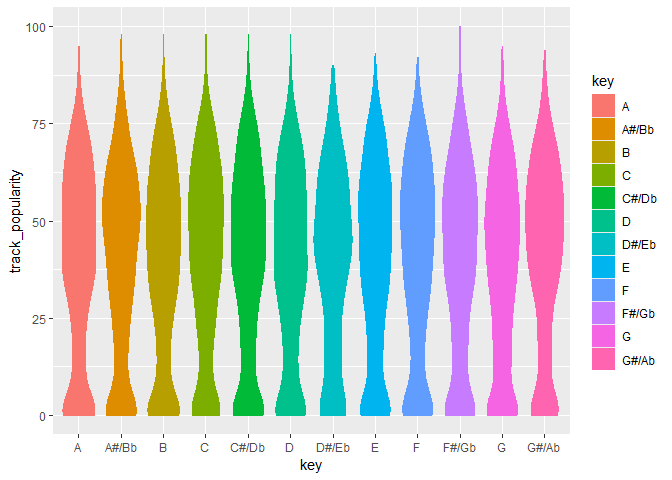

exploratory correlation
================
Senna
2024-11-20

``` r
spotify_df <- readr::read_csv('https://raw.githubusercontent.com/rfordatascience/tidytuesday/master/data/2020/2020-01-21/spotify_songs.csv')
```

    ## Rows: 32833 Columns: 23
    ## ── Column specification ────────────────────────────────────────────────────────
    ## Delimiter: ","
    ## chr (10): track_id, track_name, track_artist, track_album_id, track_album_na...
    ## dbl (13): track_popularity, danceability, energy, key, loudness, mode, speec...
    ## 
    ## ℹ Use `spec()` to retrieve the full column specification for this data.
    ## ℹ Specify the column types or set `show_col_types = FALSE` to quiet this message.

## Data Cleaning

#### feel free to edit as needed, just include a note explaining the changes you made.

What Congyu did here:  

1.  remove duplicated track_id.  
    There are many songs appear in this dataset more than once, under
    different genre group and subgenre group, to keep this analysis
    fair, we remove duplicated songs.
2.  remove unique ID columns we are not using.  
3.  In `track_album_release_date`, many of rows miss month and year, so
    I create a new column `track_album_release_year` only including
    release year.  
4.  factor variables.  
5.  Adjust dancibility and energy to range 0 - 100 to enlarge the effect
    on graph.(we can also do this on any other factors we are interested
    in)
6.  clean data based on data dictionary.

``` r
spotify_df <- 
  spotify_df %>% 
  distinct(track_id,.keep_all = T) %>% select(-track_id,-track_album_id,-playlist_id) %>%
  mutate(track_album_release_year = as.numeric(str_sub(track_album_release_date,1,4))) %>% 
  select(-track_album_release_date) %>% 
  mutate(playlist_name = factor(playlist_name),
         playlist_genre = factor(playlist_genre),
         playlist_subgenre = factor(playlist_subgenre)) %>% 
  mutate(danceability = danceability * 100,
         energy = energy * 100) %>% 
  mutate(key = factor(case_match(key,0 ~ "C",
                          1 ~ "C#/Db", 2 ~ "D",
                          3 ~ "D#/Eb", 4 ~ "E",
                          5 ~ "F", 6 ~ "F#/Gb",
                          7 ~ "G", 8 ~ "G#/Ab",
                          9 ~ "A", 10 ~ "A#/Bb",
                          11 ~ "B")),
         mode = factor(case_match(mode, 0 ~ "minor",
                          1 ~ "Major")),
         speechiness = factor(case_when(speechiness < 0.33 ~ "non-speech-like music",
                                 speechiness >= 0.33 & speechiness <= 0.66 ~ "mix of speech and music",
                                 speechiness > 0.66 ~ "entirely of spoken words")))
```

``` r
spotify_df %>% group_by(playlist_genre) %>% 
  summarise(genre_freq = n()) %>% knitr::kable()
```

| playlist_genre | genre_freq |
|:---------------|-----------:|
| edm            |       4877 |
| latin          |       4137 |
| pop            |       5132 |
| r&b            |       4504 |
| rap            |       5401 |
| rock           |       4305 |

``` r
spotify_df %>% 
  mutate(playlist_genre = fct_infreq(playlist_genre,track_popularity)) %>% 
  ggplot(aes(x = playlist_genre, y = track_popularity, color = playlist_genre)) + 
  geom_boxplot()
```

<!-- --> We can
see there is a obvious trend between song’s popularity and its genre.
Pop songs is the most popular genre and edm is the least.

## Question 1

``` r
numeric_var = spotify_df[sapply(spotify_df, is.numeric)]

cor_matr = melt(cor(numeric_var, use = "complete.obs"))
```

``` r
ggplot(cor_matr, aes(Var1, Var2, fill = value)) +
  geom_tile() +
  scale_fill_gradient2(low = "blue", mid = "white", high = "red", midpoint = 0, limit = c(-1, 1)) +
  theme_minimal() +
  theme(axis.text.x = element_text(angle = 45, hjust = 1)) +
  labs(title = "Correlation Heatmap", x = "Variables", y = "Variables", fill = "Correlation")
```

<!-- -->

``` r
cor_pop = spotify_df |>
  select(where(is.numeric)) |> 
  select(-track_popularity) |> 
  summarise(across(everything(), ~ cor(.x, spotify_df$track_popularity, use = "complete.obs"))) |>
  pivot_longer(everything(), names_to = "variable", values_to = "correlation") |> 
  arrange(desc(correlation))

cor_pop
```

    ## # A tibble: 10 × 2
    ##    variable                 correlation
    ##    <chr>                          <dbl>
    ##  1 acousticness                 0.0917 
    ##  2 danceability                 0.0466 
    ##  3 track_album_release_year     0.0447 
    ##  4 loudness                     0.0373 
    ##  5 valence                      0.0226 
    ##  6 tempo                        0.00445
    ##  7 liveness                    -0.0528 
    ##  8 energy                      -0.104  
    ##  9 instrumentalness            -0.124  
    ## 10 duration_ms                 -0.140

``` r
cor_pop|>
  ggplot(aes(x= variable, y = correlation))+
  geom_col() +
  theme_minimal() +
  theme(axis.text.x = element_text(angle = 45, hjust = 1)) +
  labs(title = "correlation with popularity", x = "Variable", y = "correlation")
```

<!-- -->

## Question 3

### energy

``` r
lm(track_popularity ~ energy, data = spotify_df) %>% 
  summary()
```

    ## 
    ## Call:
    ## lm(formula = track_popularity ~ energy, data = spotify_df)
    ## 
    ## Residuals:
    ##     Min      1Q  Median      3Q     Max 
    ## -48.295 -18.181   2.921  18.545  59.977 
    ## 
    ## Coefficients:
    ##             Estimate Std. Error t value Pr(>|t|)    
    ## (Intercept) 48.67731    0.55092   88.36   <2e-16 ***
    ## energy      -0.13384    0.00763  -17.54   <2e-16 ***
    ## ---
    ## Signif. codes:  0 '***' 0.001 '**' 0.01 '*' 0.05 '.' 0.1 ' ' 1
    ## 
    ## Residual standard error: 23.58 on 28354 degrees of freedom
    ## Multiple R-squared:  0.01074,    Adjusted R-squared:  0.0107 
    ## F-statistic: 307.8 on 1 and 28354 DF,  p-value: < 2.2e-16

From this simple linear regression, we got a super small p-value, which
means we can reject the null hypothesis and conclude that energy is a
significant predictor for popularity.

``` r
spotify_df %>% 
  ggplot(aes(x = energy)) + 
  geom_histogram()
```

    ## `stat_bin()` using `bins = 30`. Pick better value with `binwidth`.

<!-- --> From
this plot we can see, singers prefer to produce and sing energetic
(fast, loud, and noisy) music.

``` r
spotify_df %>% 
  ggplot(aes(x = energy, y = track_popularity)) + 
  geom_hex()+
  geom_smooth()
```

    ## `geom_smooth()` using method = 'gam' and formula = 'y ~ s(x, bs = "cs")'

<!-- -->

``` r
spotify_df %>% group_by(playlist_genre) %>% 
  ggplot(aes(x = energy, y = track_popularity)) + 
  geom_hex()+
  facet_wrap(~ playlist_genre,nrow = 2)
```

<!-- -->
Although, we realize that energy is a significant predictor for
popularity and current singers and song producers prefer quick and loud
songs. Unfortunalty, we cannot see obvious relationship between songs’
energy and songs’ popularity.

### key

``` r
spotify_df %>% mutate(key = fct_infreq(key)) %>% 
  ggplot(aes(x = key)) + 
  geom_bar()
```

<!-- --> From
this plot we can see, the most commonly used key is `C#/Db`. Because
`C#/Db` keys are often used in `R&B` and `Pop` genre. Other than that,
singers love to use simpler keys without sharp key or flat key.

``` r
spotify_df %>% 
  ggplot(aes(x = key, y = track_popularity,fill = key,color = key)) + 
  geom_violin()
```

<!-- -->

``` r
spotify_df %>% group_by(playlist_genre) %>% 
  ggplot(aes(x = key, y = track_popularity, fill = key)) + 
  geom_boxplot()+
  facet_wrap(~ playlist_genre,nrow = 2)+
  theme(axis.text.x = element_text(size = 4,angle = 30))
```

<!-- -->
Although, we realize that energy is a significant predictor for
popularity and current singers and song producers prefer quick and loud
songs. Unfortunalty, we cannot see obvious relationship between songs’
energy and songs’ popularity.
