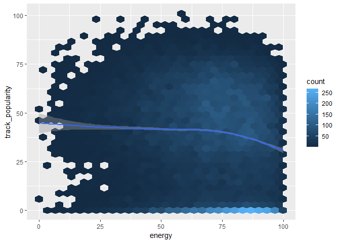
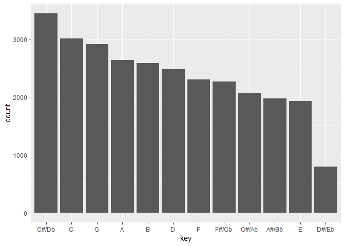
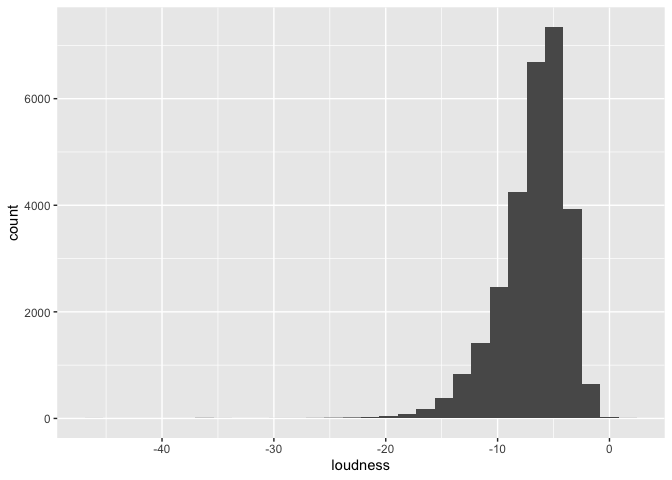

exploratory correlation
================
Senna
2024-11-20

``` r
spotify_df <- readr::read_csv('https://raw.githubusercontent.com/rfordatascience/tidytuesday/master/data/2020/2020-01-21/spotify_songs.csv')
```

    ## Rows: 32833 Columns: 23
    ## ── Column specification ────────────────────────────────────────────────────────
    ## Delimiter: ","
    ## chr (10): track_id, track_name, track_artist, track_album_id, track_album_na...
    ## dbl (13): track_popularity, danceability, energy, key, loudness, mode, speec...
    ## 
    ## ℹ Use `spec()` to retrieve the full column specification for this data.
    ## ℹ Specify the column types or set `show_col_types = FALSE` to quiet this message.

## Data Cleaning

#### feel free to edit as needed, just include a note explaining the changes you made.

What Congyu did here:  

1.  remove duplicated track_id.  
    There are many songs appear in this dataset more than once, under
    different genre group and subgenre group, to keep this analysis
    fair, we remove duplicated songs.
2.  remove unique ID columns we are not using.  
3.  In `track_album_release_date`, many of rows miss month and year, so
    I create a new column `track_album_release_year` only including
    release year.  
4.  factor variables.  
5.  Adjust dancibility and energy to range 0 - 100 to enlarge the effect
    on graph.(we can also do this on any other factors we are interested
    in)
6.  clean data based on data dictionary.

``` r
spotify_df <- 
  spotify_df %>% 
  distinct(track_id,.keep_all = T) %>% select(-track_id,-track_album_id,-playlist_id) %>%
  mutate(track_album_release_year = as.numeric(str_sub(track_album_release_date,1,4))) %>% 
  select(-track_album_release_date) %>% 
  mutate(playlist_name = factor(playlist_name),
         playlist_genre = factor(playlist_genre),
         playlist_subgenre = factor(playlist_subgenre)) %>% 
  mutate(danceability = danceability * 100,
         energy = energy * 100) %>% 
  mutate(key = factor(case_match(key,0 ~ "C",
                          1 ~ "C#/Db", 2 ~ "D",
                          3 ~ "D#/Eb", 4 ~ "E",
                          5 ~ "F", 6 ~ "F#/Gb",
                          7 ~ "G", 8 ~ "G#/Ab",
                          9 ~ "A", 10 ~ "A#/Bb",
                          11 ~ "B")),
         mode = factor(case_match(mode, 0 ~ "minor",1 ~ "Major")),
         speechiness = factor(case_when(speechiness < 0.33 ~ "non-speech-like music",
                                 speechiness >= 0.33 & speechiness <= 0.66 ~ "mix of speech and music",
                                 speechiness > 0.66 ~ "entirely of spoken words")))
```

``` r
spotify_df %>% group_by(playlist_genre) %>% 
  summarise(genre_freq = n()) %>% knitr::kable()
```

| playlist_genre | genre_freq |
|:---------------|-----------:|
| edm            |       4877 |
| latin          |       4137 |
| pop            |       5132 |
| r&b            |       4504 |
| rap            |       5401 |
| rock           |       4305 |

``` r
spotify_df %>% 
  mutate(playlist_genre = fct_infreq(playlist_genre,track_popularity)) %>% 
  ggplot(aes(x = playlist_genre, y = track_popularity, color = playlist_genre)) + 
  geom_boxplot()
```

<!-- --> We can
see there is a obvious trend between song’s popularity and its genre.
Pop songs is the most popular genre and edm is the least.

## Question 1

``` r
numeric_var = spotify_df[sapply(spotify_df, is.numeric)]

cor_matr = melt(cor(numeric_var, use = "complete.obs"))
```

``` r
ggplot(cor_matr, aes(Var1, Var2, fill = value)) +
  geom_tile() +
  scale_fill_gradient2(low = "blue", mid = "white", high = "red", midpoint = 0, limit = c(-1, 1)) +
  theme_minimal() +
  theme(axis.text.x = element_text(angle = 45, hjust = 1)) +
  labs(title = "Correlation Heatmap", x = "Variables", y = "Variables", fill = "Correlation")
```

<!-- -->

``` r
cor_pop = spotify_df |>
  select(where(is.numeric)) |> 
  select(-track_popularity) |> 
  summarise(across(everything(), ~ cor(.x, spotify_df$track_popularity, use = "complete.obs"))) |>
  pivot_longer(everything(), names_to = "variable", values_to = "correlation") |> 
  arrange(desc(correlation))

cor_pop
```

    ## # A tibble: 10 × 2
    ##    variable                 correlation
    ##    <chr>                          <dbl>
    ##  1 acousticness                 0.0917 
    ##  2 danceability                 0.0466 
    ##  3 track_album_release_year     0.0447 
    ##  4 loudness                     0.0373 
    ##  5 valence                      0.0226 
    ##  6 tempo                        0.00445
    ##  7 liveness                    -0.0528 
    ##  8 energy                      -0.104  
    ##  9 instrumentalness            -0.124  
    ## 10 duration_ms                 -0.140

``` r
cor_pop|>
  ggplot(aes(x= variable, y = correlation))+
  geom_col() +
  theme_minimal() +
  theme(axis.text.x = element_text(angle = 45, hjust = 1)) +
  labs(title = "correlation with popularity", x = "Variable", y = "correlation")
```

<!-- -->

## Question 3

### energy

``` r
lm(track_popularity ~ energy, data = spotify_df) %>% 
  summary()
```

    ## 
    ## Call:
    ## lm(formula = track_popularity ~ energy, data = spotify_df)
    ## 
    ## Residuals:
    ##     Min      1Q  Median      3Q     Max 
    ## -48.295 -18.181   2.921  18.545  59.977 
    ## 
    ## Coefficients:
    ##             Estimate Std. Error t value Pr(>|t|)    
    ## (Intercept) 48.67731    0.55092   88.36   <2e-16 ***
    ## energy      -0.13384    0.00763  -17.54   <2e-16 ***
    ## ---
    ## Signif. codes:  0 '***' 0.001 '**' 0.01 '*' 0.05 '.' 0.1 ' ' 1
    ## 
    ## Residual standard error: 23.58 on 28354 degrees of freedom
    ## Multiple R-squared:  0.01074,    Adjusted R-squared:  0.0107 
    ## F-statistic: 307.8 on 1 and 28354 DF,  p-value: < 2.2e-16

From this simple linear regression, we got a super small p-value, which
means we can reject the null hypothesis and conclude that energy is a
significant predictor for popularity.

``` r
spotify_df %>% 
  ggplot(aes(x = energy)) + 
  geom_histogram()
```

    ## `stat_bin()` using `bins = 30`. Pick better value with `binwidth`.

<!-- --> From
this plot we can see, singers prefer to produce and sing energetic
(fast, loud, and noisy) music.

``` r
spotify_df %>% group_by(playlist_genre) %>% 
  ggplot(aes(x = energy, y = track_popularity)) + 
  geom_hex()+
  facet_wrap(~ playlist_genre,nrow = 2)
```

<!-- -->
Although, we realize that energy is a significant predictor for
popularity and current singers and song producers prefer quick and loud
songs. Unfortunate, we cannot see obvious relationship between songs’
energy and songs’ popularity.

Try k-mean

``` r
energy_popularity <- spotify_df %>% 
  select(track_popularity,energy)

kmeans_energy <- 
  kmeans(x = energy_popularity, centers = 3)

kmeans_energy
```

    ## K-means clustering with 3 clusters of sizes 11861, 9308, 7187
    ## 
    ## Cluster means:
    ##   track_popularity   energy
    ## 1         54.22258 80.08268
    ## 2         11.12108 74.05834
    ## 3         51.28510 47.46792
    ## 
    ## Clustering vector:
    ##     [1] 1 1 1 1 1 1 1 1 1 1 1 1 1 1 1 1 1 1 3 1 1 1 1 1 1 1 1 2 1 2 1 1 1 1 1 1
    ##    [37] 1 1 1 1 1 1 1 3 1 1 1 1 1 1 1 1 1 1 1 1 1 3 1 1 1 1 1 1 1 1 1 1 1 1 1 1
    ##    [73] 3 1 1 1 1 1 1 3 1 1 1 1 1 1 1 1 1 2 1 1 1 2 1 1 1 1 1 3 1 3 1 1 1 1 1 1
    ##   [109] 1 1 1 1 3 1 1 1 3 1 2 1 2 1 1 1 3 3 1 1 1 2 1 1 1 3 3 1 1 3 1 1 1 1 1 1
    ##   [145] 1 1 1 3 1 1 1 1 2 1 1 1 1 1 1 2 1 1 2 1 1 1 1 1 2 1 1 3 1 1 1 1 1 1 1 3
    ##   [181] 1 1 1 1 1 3 3 1 1 3 1 1 3 1 1 1 1 1 1 1 1 1 1 1 3 1 1 1 2 1 1 1 1 1 1 1
    ##   [217] 2 1 3 1 1 1 1 1 2 1 1 1 1 1 1 1 2 1 1 2 1 1 2 3 1 1 1 1 3 1 1 1 1 1 2 1
    ##   [253] 2 1 1 1 1 1 1 1 3 1 1 1 1 1 1 2 1 3 1 1 1 1 1 1 1 1 1 1 3 1 3 3 1 1 1 1
    ##   [289] 1 3 1 1 1 1 1 1 1 3 1 3 1 1 1 1 1 1 1 1 1 1 1 2 3 3 1 1 1 1 1 1 3 3 1 2
    ##   [325] 1 1 1 1 1 1 1 1 1 1 1 1 1 3 1 3 2 1 1 1 3 1 2 1 1 2 2 1 1 1 1 1 1 3 2 1
    ##   [361] 1 2 2 1 1 1 1 1 2 2 2 1 1 1 1 3 2 1 2 1 1 1 2 2 1 1 3 2 2 2 1 1 1 1 2 2
    ##   [397] 2 1 1 3 1 2 3 2 2 1 2 2 1 1 1 2 1 3 3 1 2 2 2 3 2 3 1 3 2 1 2 2 3 2 1 2
    ##   [433] 2 1 2 2 1 1 1 1 1 1 1 1 1 1 1 1 1 1 1 1 1 1 1 1 1 1 1 2 1 1 3 1 1 1 1 2
    ##   [469] 2 1 1 2 1 1 1 1 2 1 1 1 1 1 1 1 1 1 1 1 1 3 1 1 1 1 1 1 1 1 1 2 1 1 1 2
    ##   [505] 2 3 1 2 2 1 1 2 1 2 1 1 1 1 1 1 1 1 2 1 1 1 1 3 1 2 1 1 2 1 1 2 1 1 1 2
    ##   [541] 1 3 1 1 1 3 1 1 1 1 1 1 1 1 1 1 1 1 2 1 1 2 3 1 3 2 1 3 1 1 1 1 2 1 1 1
    ##   [577] 1 3 1 1 3 3 3 3 1 3 1 1 1 1 1 1 1 1 1 1 1 1 1 1 1 1 1 1 1 1 1 1 2 1 3 1
    ##   [613] 3 1 1 3 3 1 1 1 1 3 1 1 1 1 1 1 1 1 3 1 1 1 1 1 1 1 1 1 1 1 1 1 1 2 1 1
    ##   [649] 1 1 1 1 1 1 1 1 3 1 3 3 1 1 3 3 1 1 1 1 1 1 2 1 1 1 2 1 1 3 1 1 3 1 3 1
    ##   [685] 3 1 1 1 1 3 1 1 3 1 3 1 3 1 1 1 1 1 1 1 3 1 1 1 1 3 1 3 2 1 1 1 1 1 3 3
    ##   [721] 1 1 1 1 1 1 1 1 1 1 1 3 1 1 1 3 3 1 3 3 1 1 3 3 1 3 3 2 1 1 2 2 2 1 2 1
    ##   [757] 2 1 1 2 2 1 2 1 1 1 2 1 1 3 2 3 2 1 1 3 2 1 1 1 1 1 1 2 1 2 1 1 1 1 1 2
    ##   [793] 1 1 1 2 2 1 1 1 2 2 1 2 1 2 1 3 3 2 2 1 1 1 1 1 2 1 1 3 1 1 2 1 1 1 1 2
    ##   [829] 1 1 2 1 1 2 1 1 1 2 1 1 1 1 1 1 1 1 1 1 1 1 1 3 3 1 1 3 1 1 1 1 3 3 3 3
    ##   [865] 2 1 2 1 2 2 1 3 1 3 1 2 1 2 1 1 1 2 1 2 1 1 2 2 2 1 1 2 1 2 1 1 1 1 2 1
    ##   [901] 3 1 2 1 3 2 2 2 3 1 2 1 2 2 2 2 1 2 2 3 3 2 3 2 2 2 2 1 2 1 1 1 2 1 2 2
    ##   [937] 1 2 1 2 2 2 2 2 2 1 2 2 1 1 2 1 2 1 2 2 2 2 3 2 2 1 2 2 1 2 1 2 2 2 2 3
    ##   [973] 2 2 2 2 1 1 2 1 1 1 1 3 2 3 1 1 1 1 1 1 2 1 1 1 3 2 1 1 1 1 1 2 1 1 2 3
    ##  [1009] 2 3 2 1 1 2 1 3 2 3 1 2 1 2 2 2 1 2 2 2 1 1 1 2 2 2 3 1 1 3 2 2 1 1 1 2
    ##  [1045] 2 2 1 2 1 1 1 1 1 1 2 1 2 2 2 1 2 2 3 2 1 1 1 3 1 1 1 3 3 3 1 1 3 1 3 3
    ##  [1081] 3 3 1 3 3 1 1 3 1 3 3 3 1 1 3 1 3 3 1 1 3 3 1 3 3 2 3 1 1 3 1 3 3 1 3 1
    ##  [1117] 3 3 1 3 3 3 1 3 3 3 1 1 3 1 1 3 1 1 3 3 1 1 1 1 3 3 3 3 1 1 3 3 2 3 1 3
    ##  [1153] 1 1 1 1 1 1 1 1 1 1 1 3 1 1 3 3 3 3 1 2 3 3 2 1 3 3 2 1 3 2 1 3 3 3 3 3
    ##  [1189] 3 3 3 2 1 1 2 1 2 2 1 1 2 2 2 3 3 1 1 2 2 1 3 3 1 1 1 1 3 1 1 3 3 1 3 3
    ##  [1225] 3 3 1 1 3 3 1 1 1 1 3 1 1 1 3 1 1 3 1 1 2 1 1 3 2 1 3 3 1 1 1 1 1 1 3 1
    ##  [1261] 1 3 1 1 1 1 1 1 1 2 1 1 3 1 2 2 2 3 1 3 2 1 2 3 3 2 1 3 2 3 1 1 2 1 2 2
    ##  [1297] 2 3 3 1 1 3 3 1 1 1 3 3 1 1 3 1 1 1 3 3 1 1 1 3 3 1 3 3 1 1 1 1 3 1 1 1
    ##  [1333] 1 3 3 1 1 3 1 1 3 3 3 3 3 3 1 1 3 1 3 2 1 1 1 2 1 1 1 1 1 2 3 1 1 1 1 3
    ##  [1369] 1 1 1 3 3 1 1 1 1 1 1 3 1 3 1 1 3 1 1 1 1 1 1 1 1 1 1 1 1 1 3 3 1 1 1 3
    ##  [1405] 1 1 1 3 1 3 1 1 3 3 3 1 1 1 3 1 3 1 3 1 1 1 3 1 1 3 1 3 1 1 1 1 1 1 1 3
    ##  [1441] 1 1 3 3 1 1 1 3 1 1 1 3 1 1 1 1 1 1 1 1 1 1 1 1 1 3 3 3 3 3 3 3 3 3 3 1
    ##  [1477] 1 1 1 3 3 1 1 1 1 1 2 1 1 1 3 3 3 3 3 3 3 3 3 1 1 3 1 3 3 3 3 3 3 3 3 3
    ##  [1513] 3 3 3 1 1 1 1 3 3 3 3 1 1 1 3 3 3 3 3 2 1 1 1 1 1 2 1 1 1 3 1 1 1 1 1 1
    ##  [1549] 1 1 3 3 3 1 1 1 3 2 2 1 1 1 1 1 1 1 1 1 1 1 1 1 1 3 2 2 2 2 2 2 2 2 2 2
    ##  [1585] 2 2 2 2 2 2 2 2 2 2 2 2 2 2 2 2 2 2 2 2 2 2 2 2 2 2 2 2 2 1 1 1 3 3 1 1
    ##  [1621] 1 3 1 2 1 2 1 2 2 1 1 1 1 2 2 2 2 2 2 2 2 2 2 1 2 2 2 2 2 2 2 2 2 2 2 1
    ##  [1657] 3 1 3 3 1 3 3 1 1 3 1 3 1 1 3 1 3 1 3 1 3 1 1 1 1 1 1 3 3 3 1 1 1 1 3 1
    ##  [1693] 1 1 3 2 1 1 3 2 2 2 3 2 2 2 3 2 1 3 1 1 3 3 1 3 3 3 1 1 1 1 1 1 3 3 1 1
    ##  [1729] 1 2 3 2 2 3 2 1 1 3 1 2 1 1 2 2 2 2 1 3 1 1 2 2 1 1 1 1 1 1 1 1 3 2 1 1
    ##  [1765] 1 1 1 1 1 1 1 1 1 3 1 1 1 1 1 2 1 3 2 2 3 2 2 2 1 2 3 2 3 2 1 2 2 3 2 3
    ##  [1801] 1 2 3 1 1 1 1 1 1 1 1 1 1 2 2 1 1 1 1 3 1 1 3 1 1 1 1 1 1 1 1 1 1 1 1 2
    ##  [1837] 1 1 1 1 1 1 1 1 1 1 1 1 1 1 1 1 1 1 1 1 1 1 1 1 2 1 1 1 1 1 2 2 3 3 1 1
    ##  [1873] 1 1 1 2 1 1 1 1 3 1 1 1 3 1 1 1 1 1 1 1 1 1 2 1 2 3 3 1 3 3 1 1 1 3 3 3
    ##  [1909] 1 1 1 3 3 2 2 1 3 1 2 1 3 3 2 3 3 3 3 3 3 2 2 2 1 3 3 3 2 2 3 1 3 2 1 3
    ##  [1945] 2 1 3 1 1 3 3 3 1 3 3 1 1 3 3 3 1 3 3 1 1 3 1 3 3 1 1 1 1 1 3 3 3 3 3 3
    ##  [1981] 3 3 2 1 3 3 3 2 3 3 3 1 1 1 3 1 1 1 1 1 1 1 1 1 1 1 1 1 1 1 1 1 1 1 1 1
    ##  [2017] 1 1 1 1 3 1 1 1 1 3 1 1 1 1 1 1 2 1 1 1 3 2 1 1 1 1 2 3 2 2 1 1 2 2 1 1
    ##  [2053] 1 1 1 1 2 2 1 2 1 2 1 3 1 1 2 1 1 2 1 1 2 2 1 2 2 2 2 1 2 2 2 2 1 1 2 2
    ##  [2089] 1 3 1 2 1 1 3 2 1 1 3 2 2 2 2 2 2 2 2 2 2 2 2 1 1 2 2 2 2 1 2 2 1 1 3 1
    ##  [2125] 1 3 1 1 1 1 3 3 3 1 3 3 1 1 3 2 1 1 3 1 1 3 3 3 1 1 3 3 1 1 1 2 1 1 3 1
    ##  [2161] 3 3 3 3 3 3 3 3 3 3 3 3 2 1 3 3 3 1 1 1 1 1 1 1 1 1 1 1 3 1 1 1 1 1 1 1
    ##  [2197] 1 1 1 1 1 1 1 3 1 1 1 1 1 3 1 1 1 1 1 2 2 1 1 1 2 1 1 1 3 1 1 1 1 1 1 1
    ##  [2233] 1 1 1 1 1 3 1 1 3 1 3 3 1 3 1 1 1 3 1 1 1 3 1 1 1 1 1 1 1 1 1 1 1 3 1 1
    ##  [2269] 1 1 1 3 1 1 1 1 1 1 3 2 2 3 1 1 1 3 1 1 1 1 1 1 1 1 1 3 1 1 1 3 1 1 1 1
    ##  [2305] 1 1 1 1 1 1 1 1 1 1 1 1 1 1 1 1 1 1 1 1 1 1 1 1 1 1 1 1 3 1 1 2 1 1 1 2
    ##  [2341] 1 1 2 2 3 3 1 3 1 2 2 1 1 2 1 2 2 1 2 1 1 3 2 2 3 1 1 1 2 2 2 2 1 2 3 2
    ##  [2377] 1 2 2 2 2 3 2 1 2 1 2 1 2 2 3 1 2 2 3 2 2 2 1 2 2 3 2 2 1 2 1 2 2 3 1 3
    ##  [2413] 1 2 2 1 1 3 2 2 1 2 2 2 2 1 2 2 1 1 2 2 2 1 2 1 1 2 2 1 2 1 2 2 1 2 2 2
    ##  [2449] 3 2 1 1 2 2 1 1 2 2 1 3 2 3 2 1 2 3 1 1 1 1 3 1 1 1 1 2 3 1 2 1 2 2 2 3
    ##  [2485] 1 3 1 3 1 1 1 2 2 1 1 3 1 1 3 1 1 1 1 1 1 2 1 1 1 2 1 1 1 3 1 1 1 1 3 3
    ##  [2521] 3 3 2 2 2 1 3 2 2 2 3 1 1 2 2 2 1 2 2 1 2 1 3 2 1 3 2 1 1 2 2 1 3 1 1 2
    ##  [2557] 1 2 1 2 2 1 2 3 1 1 1 2 2 2 2 1 1 2 1 1 2 2 1 1 1 2 3 2 2 3 2 1 1 2 1 2
    ##  [2593] 2 2 1 2 3 1 2 2 2 1 2 2 2 1 1 2 2 2 2 2 2 2 2 2 2 2 2 2 2 2 2 2 2 2 2 2
    ##  [2629] 2 2 3 2 2 2 2 2 2 1 2 2 2 2 3 2 2 2 2 2 3 1 1 3 1 1 1 1 2 3 1 1 1 1 3 1
    ##  [2665] 1 1 1 1 1 1 1 3 1 3 1 3 1 1 1 2 1 1 1 1 3 1 1 1 3 1 1 2 2 1 1 1 1 3 2 2
    ##  [2701] 1 2 1 1 1 1 2 2 2 2 2 2 1 2 1 1 1 1 2 2 2 1 1 2 1 2 1 1 1 1 2 1 2 1 1 2
    ##  [2737] 1 2 2 1 2 2 1 3 3 3 3 1 3 3 1 1 3 1 3 1 1 3 1 3 1 1 3 1 1 1 1 3 3 1 1 3
    ##  [2773] 1 3 1 3 1 1 3 2 2 2 2 1 1 1 1 1 1 3 1 3 3 3 1 1 1 1 1 1 1 1 2 3 1 3 1 1
    ##  [2809] 1 1 1 2 3 2 2 1 2 1 1 2 3 3 1 3 2 1 3 1 3 1 1 2 1 1 1 1 1 1 1 1 1 1 1 1
    ##  [2845] 2 2 2 2 1 1 3 2 1 1 1 1 1 1 1 1 3 1 1 1 1 2 3 3 3 1 1 1 1 3 1 1 1 1 1 1
    ##  [2881] 3 3 3 3 3 1 1 3 1 1 1 1 1 1 3 3 3 1 3 1 3 1 1 1 3 1 3 1 1 3 1 1 1 1 3 1
    ##  [2917] 1 3 1 1 3 3 1 2 3 1 3 3 1 3 3 3 1 1 3 3 1 1 3 3 3 3 1 1 1 1 3 3 2 2 2 3
    ##  [2953] 3 1 2 2 1 3 2 1 1 2 1 2 2 1 2 1 2 3 2 2 2 1 1 2 1 2 1 1 1 1 1 3 1 2 2 2
    ##  [2989] 1 1 2 2 1 2 1 1 3 2 2 2 3 3 1 1 2 2 1 1 2 3 3 1 1 1 3 3 2 3 2 2 1 2 2 1
    ##  [3025] 1 2 2 2 2 2 3 1 3 2 3 2 1 3 3 2 2 1 3 3 3 3 1 1 3 2 1 1 2 1 1 1 1 1 1 1
    ##  [3061] 1 1 1 1 3 3 1 1 3 3 1 3 1 1 1 3 1 1 1 1 1 3 2 1 2 2 2 1 1 3 2 1 3 2 1 1
    ##  [3097] 2 3 2 2 1 2 2 2 2 1 2 2 2 3 2 1 2 2 3 1 1 3 1 3 3 3 2 2 1 2 1 1 2 2 2 2
    ##  [3133] 2 1 1 1 1 1 1 1 1 1 1 3 1 2 2 2 2 2 2 1 2 2 2 2 3 2 2 1 2 2 2 2 2 3 3 2
    ##  [3169] 1 3 1 2 2 2 3 1 2 2 2 1 2 1 1 2 2 2 2 3 3 3 2 2 1 1 1 2 3 1 2 1 3 1 2 2
    ##  [3205] 1 2 2 1 1 3 2 3 2 2 2 3 3 2 2 3 2 2 2 2 2 2 2 1 1 2 2 2 2 2 2 3 2 2 1 3
    ##  [3241] 3 2 2 2 1 1 2 1 3 1 1 2 2 2 2 2 2 2 2 2 2 2 2 2 2 2 1 1 2 2 2 2 2 2 3 2
    ##  [3277] 2 2 2 2 2 2 2 2 2 2 2 2 1 2 2 2 3 1 2 1 1 2 2 2 2 1 1 2 2 2 2 2 2 2 2 1
    ##  [3313] 1 2 2 2 2 1 2 1 1 2 3 2 2 2 1 1 2 2 1 1 1 2 2 2 2 1 2 2 3 2 1 2 2 1 2 2
    ##  [3349] 2 2 2 1 2 1 2 2 2 2 2 3 3 1 3 1 1 2 2 3 1 1 1 3 1 3 1 3 3 2 1 3 2 3 2 3
    ##  [3385] 3 2 2 3 3 2 3 1 2 2 2 2 1 2 1 2 1 2 2 1 1 2 2 2 1 1 1 1 1 2 2 2 3 3 3 3
    ##  [3421] 3 3 2 3 3 3 3 3 3 2 1 3 2 3 3 2 3 2 2 1 1 1 3 2 3 2 1 1 3 1 1 1 3 2 3 3
    ##  [3457] 1 1 1 1 1 1 2 2 1 1 2 1 1 2 3 3 1 2 1 2 1 3 1 1 1 1 1 2 2 1 1 1 1 1 2 2
    ##  [3493] 3 2 3 2 2 1 1 1 3 1 1 3 2 2 1 2 3 2 3 1 1 2 2 2 1 2 1 1 1 2 2 1 1 1 2 1
    ##  [3529] 3 1 1 3 2 1 1 1 2 1 1 1 3 1 1 3 1 3 1 1 3 1 3 1 1 2 1 3 1 1 3 3 3 1 1 1
    ##  [3565] 1 3 1 1 1 1 1 3 3 1 1 1 1 1 1 1 1 2 2 3 1 1 2 1 1 2 1 1 3 3 1 1 1 2 2 1
    ##  [3601] 1 1 3 3 1 2 1 1 3 3 2 1 1 3 2 2 2 2 1 2 3 3 3 3 3 1 1 1 2 3 1 1 3 3 3 2
    ##  [3637] 2 3 1 2 1 3 3 2 3 2 1 2 2 2 2 2 1 2 3 2 1 1 3 1 2 3 3 2 3 2 2 1 1 1 2 2
    ##  [3673] 3 3 2 2 2 2 2 2 2 2 1 2 2 2 2 2 1 1 3 1 2 3 3 3 2 2 3 3 3 2 2 2 2 1 2 3
    ##  [3709] 3 2 3 2 2 3 2 2 3 1 2 1 2 2 2 1 3 2 3 1 2 2 1 2 1 2 2 3 1 1 3 2 2 1 1 2
    ##  [3745] 1 2 1 2 1 3 3 3 2 2 1 1 2 2 1 1 1 1 2 2 3 3 1 1 3 3 2 1 2 3 3 2 1 3 3 1
    ##  [3781] 3 3 1 3 1 3 1 3 3 1 1 3 1 1 1 1 3 1 1 1 1 3 1 1 1 1 3 1 1 1 1 3 1 3 1 3
    ##  [3817] 3 1 1 1 3 1 3 1 3 3 1 1 1 1 2 3 1 3 1 1 1 3 3 3 3 1 1 1 3 1 1 1 1 2 1 1
    ##  [3853] 2 1 1 1 3 1 3 1 3 1 3 1 1 1 1 1 1 3 3 3 3 1 1 1 3 3 3 3 1 2 3 3 3 1 2 1
    ##  [3889] 3 3 1 3 2 3 3 3 3 3 1 1 3 2 1 3 2 3 2 3 3 1 3 3 1 1 3 2 3 3 3 3 3 3 3 1
    ##  [3925] 1 3 3 3 3 3 1 3 3 3 3 1 3 3 1 3 1 1 3 3 3 3 3 3 1 1 1 3 3 1 1 1 3 3 1 3
    ##  [3961] 3 1 2 1 3 2 1 1 3 3 3 1 1 1 3 3 1 3 3 1 1 3 1 3 1 3 1 3 3 3 3 3 3 3 1 3
    ##  [3997] 1 1 3 3 3 1 3 1 3 3 3 1 2 3 1 3 1 1 3 3 1 3 3 1 3 1 3 3 3 3 3 3 3 2 1 3
    ##  [4033] 3 1 3 1 1 3 3 3 3 2 1 3 1 3 3 3 3 3 3 2 3 3 3 3 2 2 3 3 3 3 3 2 2 2 3 1
    ##  [4069] 3 3 3 3 3 3 3 1 3 1 1 3 1 3 1 1 1 1 3 3 3 1 3 3 3 3 1 1 3 3 3 3 3 1 3 3
    ##  [4105] 3 3 1 1 3 1 3 3 1 3 3 1 1 3 1 1 3 1 3 1 1 1 3 1 1 3 1 3 1 1 3 1 1 1 1 1
    ##  [4141] 3 3 1 3 1 3 3 3 3 3 1 3 3 3 3 1 1 3 1 1 1 3 1 3 3 3 3 3 3 2 1 1 2 2 1 3
    ##  [4177] 1 1 1 1 1 3 3 1 1 1 1 2 1 1 1 2 3 1 1 3 1 1 1 1 1 1 1 1 3 2 1 1 1 1 1 1
    ##  [4213] 1 3 1 1 1 1 2 1 1 1 1 1 1 1 1 1 1 2 1 1 1 1 1 2 3 1 1 1 1 1 3 1 2 1 1 2
    ##  [4249] 1 2 2 2 1 2 1 2 1 3 1 1 1 1 2 1 1 2 1 1 1 1 1 1 1 1 3 1 2 2 1 1 2 1 1 2
    ##  [4285] 2 2 1 3 2 2 1 1 2 1 1 3 2 3 2 1 1 1 1 3 3 3 1 2 1 1 2 2 1 1 1 1 1 1 2 1
    ##  [4321] 1 3 1 3 2 3 1 2 2 3 2 1 3 1 3 3 1 3 3 3 1 1 1 1 1 3 1 3 1 2 1 1 1 1 3 3
    ##  [4357] 1 2 3 1 2 2 1 2 1 3 1 1 1 1 1 1 1 3 1 1 3 1 3 3 3 1 1 3 1 1 1 1 1 3 3 1
    ##  [4393] 3 3 3 3 3 1 1 3 3 3 3 3 3 1 3 3 3 1 1 3 3 1 1 3 1 1 3 2 1 1 3 1 3 3 3 1
    ##  [4429] 1 1 1 1 3 3 1 1 3 1 3 3 3 1 3 3 3 3 3 1 3 3 1 3 3 3 3 3 3 3 3 3 2 2 2 2
    ##  [4465] 2 2 1 2 2 1 2 2 1 1 3 3 3 3 1 2 2 2 2 2 2 2 1 2 3 1 2 3 3 1 3 2 1 2 2 2
    ##  [4501] 1 1 1 1 2 2 2 2 2 2 2 3 2 2 1 1 1 1 1 2 2 1 2 2 1 1 1 1 2 2 2 2 2 2 3 1
    ##  [4537] 1 2 2 2 1 1 1 1 3 1 3 1 1 1 1 1 3 1 3 1 3 3 3 1 1 1 1 1 3 1 1 1 1 1 1 1
    ##  [4573] 1 1 1 1 1 1 3 2 3 1 3 3 2 2 2 2 1 1 1 2 1 2 2 3 3 2 2 3 2 2 1 2 2 2 2 2
    ##  [4609] 2 2 1 1 3 2 3 3 1 2 2 2 2 3 2 2 2 2 2 2 1 1 2 3 1 3 2 2 2 2 2 2 2 3 1 2
    ##  [4645] 1 3 2 2 1 2 2 3 2 2 2 2 2 2 2 1 3 1 1 2 2 2 2 2 2 1 2 2 1 2 3 1 2 2 1 1
    ##  [4681] 2 1 1 2 1 1 2 1 2 1 1 1 1 1 1 3 1 3 2 3 2 3 2 2 2 3 3 3 1 3 1 1 1 1 3 3
    ##  [4717] 3 3 3 3 3 3 3 3 3 3 2 3 3 2 3 3 3 1 1 3 1 3 2 3 3 3 2 2 3 2 3 3 3 3 3 3
    ##  [4753] 1 3 2 3 3 2 3 3 1 3 3 3 3 3 3 3 3 1 3 1 1 2 3 3 1 2 1 1 1 1 2 1 1 1 1 1
    ##  [4789] 1 1 1 3 2 2 1 2 2 2 1 2 1 1 2 1 1 1 1 2 1 2 2 1 2 1 3 2 1 1 1 2 2 3 2 1
    ##  [4825] 3 1 1 1 3 1 1 3 2 1 3 1 2 2 2 2 1 1 1 2 2 2 1 2 2 2 2 1 3 2 3 3 1 3 2 3
    ##  [4861] 3 3 3 3 2 3 3 3 2 3 2 2 2 2 2 3 3 3 3 2 2 3 3 3 3 3 3 2 2 3 3 3 2 3 3 3
    ##  [4897] 3 2 2 2 3 2 3 1 3 2 2 3 2 2 3 2 3 3 3 2 3 3 2 3 3 3 3 2 3 3 3 2 3 3 3 3
    ##  [4933] 2 2 2 3 2 2 2 2 3 2 3 3 3 1 1 2 2 3 3 2 2 3 2 2 2 3 2 1 3 1 2 2 2 2 2 3
    ##  [4969] 3 2 3 1 3 2 2 2 2 2 2 2 2 2 2 2 2 3 2 2 2 3 3 3 3 3 3 3 3 3 3 1 2 2 2 2
    ##  [5005] 2 2 2 2 2 2 2 3 2 3 2 3 3 2 2 2 2 2 2 2 2 1 2 3 2 2 3 3 2 2 3 3 2 3 2 2
    ##  [5041] 2 1 2 2 2 2 2 2 2 2 2 2 1 1 1 2 2 1 1 2 1 2 2 2 1 1 3 2 2 2 2 2 2 1 2 2
    ##  [5077] 3 1 1 1 1 1 1 2 1 1 1 1 1 1 2 2 3 1 1 2 3 3 1 1 1 2 1 2 1 3 3 2 2 2 2 3
    ##  [5113] 2 1 2 2 2 1 3 1 3 1 1 2 3 1 3 1 1 1 3 1 1 3 3 3 3 1 1 3 1 3 3 3 1 3 1 3
    ##  [5149] 1 3 3 1 3 1 1 1 1 1 1 1 1 1 3 3 1 3 3 1 1 1 1 1 1 3 1 1 3 1 1 3 3 3 1 3
    ##  [5185] 3 3 3 3 3 3 3 3 3 3 1 2 1 3 1 1 3 3 3 3 1 3 3 3 3 1 3 3 1 3 3 3 3 3 1 3
    ##  [5221] 3 3 3 3 3 3 3 1 3 3 3 3 3 3 3 3 3 3 3 3 3 3 3 3 3 3 3 1 3 2 3 3 3 3 3 3
    ##  [5257] 3 3 3 3 3 3 3 3 3 3 3 3 1 3 3 3 3 3 3 1 3 3 3 3 3 3 3 3 3 3 3 3 3 3 3 3
    ##  [5293] 3 3 3 3 3 3 3 1 2 3 3 3 3 3 3 3 3 3 3 3 3 3 3 3 3 3 3 3 3 3 3 3 3 3 3 3
    ##  [5329] 3 3 3 3 3 2 3 3 3 3 3 3 3 3 3 3 3 3 2 3 3 3 3 3 3 3 3 3 3 3 3 3 3 3 3 3
    ##  [5365] 3 2 3 3 3 3 3 3 3 2 3 3 3 3 1 3 3 1 3 1 1 1 3 1 1 1 1 1 1 1 3 1 1 1 1 1
    ##  [5401] 1 1 1 1 1 1 3 2 3 3 1 1 3 1 3 2 1 1 3 2 3 1 2 1 2 2 3 1 2 2 2 3 2 2 1 1
    ##  [5437] 2 1 3 3 2 2 3 3 3 3 3 3 2 3 3 3 3 3 3 3 3 3 3 3 3 3 3 3 3 3 3 3 3 3 3 3
    ##  [5473] 3 3 3 3 3 3 3 3 3 3 3 3 3 3 1 3 3 3 3 3 3 3 3 2 3 1 3 3 3 3 3 2 3 3 3 3
    ##  [5509] 3 3 3 3 3 3 3 3 3 3 3 3 3 3 3 3 3 3 3 3 3 3 3 3 3 3 3 3 3 3 3 3 1 1 3 3
    ##  [5545] 1 1 3 3 3 3 3 3 3 3 3 3 1 1 1 3 1 1 1 1 1 3 3 1 3 1 1 3 3 3 3 3 1 1 3 3
    ##  [5581] 1 3 1 1 3 1 1 3 3 1 1 3 1 3 1 1 1 3 1 3 1 3 1 3 3 3 1 1 1 1 1 3 1 3 1 3
    ##  [5617] 1 1 1 1 1 3 3 1 1 3 3 3 3 3 2 3 3 3 1 1 2 1 3 1 3 1 1 2 2 1 1 3 1 3 1 3
    ##  [5653] 1 1 3 1 1 1 1 1 3 3 3 1 3 1 1 1 1 2 3 1 1 1 1 1 1 1 1 1 1 3 1 1 1 1 1 3
    ##  [5689] 3 1 3 3 1 2 2 1 1 1 1 2 1 1 1 3 1 3 1 1 3 3 1 1 3 3 2 3 1 1 1 1 1 3 1 1
    ##  [5725] 1 3 3 1 2 3 1 3 1 2 3 3 3 1 3 1 3 3 2 3 3 3 3 3 1 1 1 3 3 1 3 2 3 3 1 2
    ##  [5761] 3 1 1 3 3 1 2 2 3 2 2 1 2 1 3 1 2 3 1 3 1 2 1 3 1 2 3 1 1 3 2 3 1 1 3 3
    ##  [5797] 1 3 3 3 2 3 3 2 1 3 3 2 3 1 3 1 3 3 1 3 3 1 2 3 1 1 3 3 3 3 1 1 1 1 3 3
    ##  [5833] 1 2 2 1 1 2 1 3 1 3 3 3 2 3 1 1 3 3 1 3 3 1 1 3 3 3 3 3 3 3 1 3 1 1 3 1
    ##  [5869] 3 1 3 1 1 3 3 2 3 3 3 1 3 3 1 1 1 1 1 3 1 3 3 3 1 1 1 3 2 3 3 3 3 1 3 1
    ##  [5905] 1 1 3 1 3 3 1 1 3 3 3 1 1 1 1 3 3 1 3 3 1 3 3 1 2 3 1 1 1 3 3 3 1 1 1 3
    ##  [5941] 1 1 1 1 1 3 1 1 1 3 3 3 3 3 1 3 3 3 3 1 1 3 1 3 3 3 3 1 1 1 1 1 3 3 1 1
    ##  [5977] 3 1 3 1 3 3 1 1 1 3 2 3 3 1 1 1 3 1 3 1 3 1 3 1 1 3 1 2 2 2 2 2 2 2 2 2
    ##  [6013] 2 2 2 2 2 2 2 1 1 1 3 1 1 1 1 1 1 1 1 3 3 1 3 1 1 1 1 3 2 1 1 1 1 1 3 1
    ##  [6049] 2 1 2 1 2 1 3 1 1 3 2 1 2 2 3 3 3 3 3 3 3 3 3 1 3 1 3 3 3 3 3 3 1 3 3 3
    ##  [6085] 1 3 2 3 3 3 2 3 3 3 1 2 3 3 3 3 3 3 3 3 3 2 1 3 3 3 3 3 3 3 3 3 3 3 3 3
    ##  [6121] 3 2 3 3 2 3 3 3 3 3 1 3 3 3 3 3 3 2 3 3 1 3 3 3 3 3 3 3 2 3 2 3 3 3 3 1
    ##  [6157] 2 1 1 2 3 2 1 1 1 2 1 3 2 3 1 3 1 3 1 1 1 1 3 1 1 1 1 1 1 1 1 3 2 3 1 1
    ##  [6193] 1 1 1 2 1 1 1 1 1 3 1 3 3 1 3 2 3 3 3 3 2 2 1 2 3 3 1 3 3 3 1 1 1 3 3 3
    ##  [6229] 1 1 1 3 3 3 3 3 3 1 1 3 1 1 2 3 2 3 1 1 3 2 3 1 3 3 3 1 3 1 1 3 1 3 1 3
    ##  [6265] 1 1 3 1 1 1 1 1 1 1 3 1 1 1 3 1 3 1 3 1 1 3 3 1 1 1 3 3 1 1 3 1 1 1 1 3
    ##  [6301] 3 1 1 1 1 1 3 3 1 1 1 1 1 2 1 1 1 1 1 2 1 1 3 1 1 3 2 1 1 2 1 1 2 1 1 1
    ##  [6337] 2 3 1 1 3 1 1 1 3 1 1 1 1 1 1 1 1 1 1 1 2 1 1 1 1 3 1 1 1 1 1 1 3 3 1 1
    ##  [6373] 1 3 3 1 1 3 3 3 3 3 1 1 3 1 1 1 1 3 3 3 3 1 3 3 1 1 1 3 1 1 2 1 3 3 1 1
    ##  [6409] 3 3 3 1 1 1 3 3 3 3 1 1 1 1 3 3 3 2 3 3 2 2 1 1 1 1 2 1 1 2 2 3 2 1 2 3
    ##  [6445] 1 1 2 1 1 2 1 3 1 1 1 1 2 1 2 1 1 2 1 2 2 1 1 2 2 1 1 1 2 1 3 1 1 1 1 2
    ##  [6481] 2 1 2 3 2 1 1 1 1 1 1 1 3 1 1 3 3 1 2 1 2 3 3 1 1 2 1 3 2 3 1 1 1 2 1 3
    ##  [6517] 1 1 3 1 3 1 2 3 2 1 1 2 1 1 2 1 3 1 2 2 2 1 1 1 1 2 1 1 1 3 1 1 2 3 3 1
    ##  [6553] 1 1 1 1 2 1 2 1 1 2 3 2 1 1 3 1 3 2 1 3 3 2 1 2 1 2 1 1 1 3 3 1 3 1 3 3
    ##  [6589] 3 2 2 2 1 2 3 2 2 2 1 2 3 1 2 2 3 1 2 1 2 2 3 2 3 3 1 2 1 2 2 2 2 1 2 2
    ##  [6625] 3 2 3 3 1 2 2 2 2 2 3 1 2 2 3 2 2 2 2 2 3 2 3 3 1 2 2 1 2 1 2 2 2 3 2 2
    ##  [6661] 1 2 2 2 2 3 3 2 2 2 2 2 1 2 1 3 2 1 2 2 1 3 3 2 3 2 2 3 3 3 3 3 2 2 3 2
    ##  [6697] 1 2 3 2 2 2 2 2 2 2 2 2 2 2 3 2 3 2 3 1 1 2 3 3 3 2 2 2 1 1 3 3 2 2 2 3
    ##  [6733] 2 3 2 2 2 2 2 2 2 2 2 1 2 2 2 3 1 3 3 2 2 1 3 3 2 2 2 2 2 2 2 3 3 1 3 1
    ##  [6769] 2 2 2 2 3 2 2 2 1 1 3 3 3 1 1 2 1 1 3 3 1 3 3 2 2 1 3 1 1 1 3 3 2 2 2 1
    ##  [6805] 1 2 2 2 2 3 3 2 2 2 2 2 1 1 1 2 3 1 2 3 2 2 2 1 3 1 2 2 2 2 1 3 3 1 1 2
    ##  [6841] 1 2 2 1 3 3 2 1 3 3 1 2 2 2 2 2 1 2 1 2 2 2 2 2 1 3 1 1 3 1 3 1 1 2 3 3
    ##  [6877] 1 3 3 3 3 1 1 3 1 3 3 3 1 3 1 1 1 1 2 1 1 2 1 1 1 1 1 1 2 2 2 1 2 2 3 3
    ##  [6913] 3 3 2 1 2 2 2 1 3 2 1 1 2 1 2 3 2 2 1 1 1 3 1 1 2 3 2 1 2 2 3 2 2 1 1 1
    ##  [6949] 3 2 2 2 3 2 2 3 1 1 3 3 2 2 3 2 1 2 1 3 2 2 1 2 2 3 1 1 2 3 3 3 1 1 1 3
    ##  [6985] 1 3 2 2 1 2 1 1 1 1 2 1 2 1 1 3 3 2 2 1 1 1 2 1 1 1 1 3 1 2 1 1 3 1 2 2
    ##  [7021] 1 3 2 2 1 1 3 2 2 1 2 1 1 1 1 3 1 1 1 1 1 1 1 1 1 1 2 1 2 1 1 2 2 1 1 1
    ##  [7057] 1 1 3 1 2 1 1 3 1 1 1 2 1 2 1 1 1 2 2 3 1 3 1 1 1 1 1 3 3 1 1 3 1 1 1 1
    ##  [7093] 1 1 1 3 3 1 1 3 1 3 1 3 3 3 3 3 3 1 2 1 1 1 1 1 2 2 1 1 3 1 1 1 1 1 3 3
    ##  [7129] 3 3 2 1 1 3 3 1 1 2 2 3 2 2 3 3 1 2 2 1 2 1 1 2 1 3 3 3 2 3 3 3 2 3 3 1
    ##  [7165] 3 3 3 3 3 2 2 1 1 3 3 3 3 3 3 3 3 2 2 3 2 3 3 3 3 2 1 1 2 2 1 1 3 2 3 3
    ##  [7201] 3 3 2 3 2 3 3 2 3 3 3 3 3 3 2 1 3 2 3 3 3 2 3 3 2 2 3 2 3 2 2 2 2 3 1 2
    ##  [7237] 1 1 1 1 2 3 3 2 1 2 2 3 1 3 2 1 2 2 2 3 2 1 2 2 3 2 3 2 2 3 2 2 3 3 3 2
    ##  [7273] 1 1 2 3 3 3 2 3 2 2 1 2 3 2 1 2 2 1 2 2 2 1 2 3 3 2 3 2 1 2 2 1 3 3 3 3
    ##  [7309] 3 2 2 3 1 3 3 3 1 1 2 3 3 1 2 2 3 3 3 2 1 2 2 1 3 3 3 2 2 1 2 2 2 2 1 3
    ##  [7345] 1 3 1 2 2 1 3 3 1 1 1 1 1 3 1 3 1 1 1 3 3 1 3 3 3 1 3 3 3 3 3 3 1 3 3 1
    ##  [7381] 3 3 3 3 3 3 3 1 1 3 3 1 1 3 3 2 2 3 1 1 3 3 1 1 1 1 1 3 3 2 1 3 1 3 2 1
    ##  [7417] 3 3 1 1 2 1 1 2 2 1 2 2 3 2 2 3 2 1 1 2 1 3 2 2 2 1 1 2 2 2 1 1 2 3 2 1
    ##  [7453] 2 2 2 1 2 1 2 2 1 2 1 1 1 2 2 2 1 2 2 2 2 2 2 2 2 2 2 3 2 2 1 2 1 3 2 2
    ##  [7489] 2 1 2 2 2 1 3 2 2 2 2 2 2 2 2 2 1 2 2 1 1 1 2 1 2 1 1 1 3 3 1 1 1 1 1 3
    ##  [7525] 1 2 1 3 3 3 1 1 3 1 1 1 1 1 1 3 1 1 3 1 1 1 1 1 1 3 3 1 3 1 3 1 1 1 1 3
    ##  [7561] 3 3 3 3 1 3 3 3 3 3 3 3 3 3 3 3 3 3 3 3 3 1 1 1 1 1 1 1 1 3 1 2 2 1 2 2
    ##  [7597] 2 2 2 2 1 3 3 3 2 2 1 1 2 1 1 1 3 1 3 2 3 1 2 3 3 3 1 2 1 2 2 1 2 2 1 1
    ##  [7633] 1 2 1 2 1 2 1 3 1 2 3 2 3 3 1 1 1 1 1 2 2 2 2 2 3 3 3 2 1 1 2 2 2 1 3 2
    ##  [7669] 2 2 2 2 2 2 3 2 2 2 2 2 1 3 3 3 2 1 2 1 2 2 3 1 1 1 2 2 1 1 2 2 1 1 2 2
    ##  [7705] 2 3 2 2 2 1 1 3 1 1 1 2 1 3 2 2 2 2 2 2 2 2 1 2 1 1 1 3 2 2 2 2 2 3 2 2
    ##  [7741] 2 2 1 1 1 1 2 2 2 2 2 2 2 2 2 2 2 2 2 2 2 2 2 2 2 1 2 2 1 2 2 1 1 2 1 2
    ##  [7777] 2 2 2 2 2 1 1 2 1 2 2 2 2 2 2 2 2 1 1 1 1 1 2 2 2 3 1 1 2 2 2 2 2 2 2 2
    ##  [7813] 2 2 1 1 1 1 2 2 2 2 2 2 1 2 3 1 3 2 2 1 2 3 2 2 2 2 2 2 3 2 2 2 2 2 2 1
    ##  [7849] 2 2 3 2 2 2 1 2 2 3 2 2 2 2 2 1 3 2 1 1 2 1 1 1 3 3 3 2 2 2 1 2 1 2 2 3
    ##  [7885] 3 3 1 3 3 3 2 1 1 2 2 2 2 2 1 1 2 1 1 2 2 1 1 1 3 1 2 1 3 2 2 3 3 1 3 1
    ##  [7921] 3 1 3 3 1 1 3 3 1 1 2 2 3 3 3 2 1 2 3 1 3 1 1 3 3 1 2 2 1 2 1 1 1 1 1 1
    ##  [7957] 1 3 2 2 2 2 3 1 2 2 2 3 2 2 2 2 2 2 3 1 1 1 3 3 1 1 1 1 3 1 3 1 1 1 1 1
    ##  [7993] 1 1 1 3 1 1 1 1 1 1 3 3 2 3 2 1 3 2 1 2 1 2 1 2 3 2 1 1 1 3 1 2 1 3 2 2
    ##  [8029] 3 1 1 1 1 2 1 2 3 2 1 2 3 2 2 3 2 2 2 2 1 1 3 3 1 2 3 1 2 2 2 2 1 2 2 2
    ##  [8065] 3 2 2 1 2 1 2 2 2 1 2 3 2 1 2 1 2 2 2 1 2 1 2 2 2 1 1 1 2 2 1 2 3 2 1 1
    ##  [8101] 2 2 2 2 2 2 2 2 2 2 2 2 2 1 2 1 2 2 2 1 2 1 1 1 2 2 2 1 2 3 2 1 1 2 2 1
    ##  [8137] 2 1 2 2 2 2 2 1 1 1 2 2 2 1 1 2 3 1 2 3 1 2 1 1 2 1 3 3 2 2 2 3 2 3 2 3
    ##  [8173] 2 2 3 2 2 2 2 2 2 2 2 2 2 1 3 3 2 2 1 2 1 2 2 2 2 3 2 2 2 1 2 2 1 2 2 2
    ##  [8209] 2 3 2 2 2 2 3 2 2 2 2 2 2 1 2 2 2 2 1 2 2 2 2 2 1 2 2 2 2 2 2 2 2 2 3 3
    ##  [8245] 2 1 2 2 1 2 2 2 3 3 2 2 2 2 2 2 2 2 2 2 2 1 2 2 1 1 2 1 3 2 1 1 2 2 2 1
    ##  [8281] 2 1 1 1 3 2 1 3 2 3 1 2 2 1 3 1 3 2 3 2 2 1 2 2 1 2 2 2 1 2 2 2 2 2 2 2
    ##  [8317] 2 2 2 2 2 1 2 2 2 2 3 2 2 2 2 1 1 1 2 2 2 1 1 1 1 1 1 1 1 3 3 1 3 3 2 2
    ##  [8353] 2 2 2 2 1 3 1 3 1 1 2 1 2 2 2 2 2 2 2 2 2 1 2 1 1 2 2 2 2 2 1 2 1 1 1 2
    ##  [8389] 2 2 1 2 2 1 1 2 2 2 2 2 1 1 1 1 2 1 2 2 2 2 2 2 2 2 1 2 2 2 2 3 3 2 3 2
    ##  [8425] 2 2 2 1 1 1 1 1 1 2 1 3 1 1 3 1 2 3 2 1 3 1 3 3 3 2 1 1 3 1 3 3 3 1 3 3
    ##  [8461] 1 1 3 1 2 3 1 1 2 1 2 3 1 2 2 2 2 2 1 2 2 3 2 3 2 1 2 1 2 1 2 2 1 2 1 3
    ##  [8497] 2 2 1 1 1 2 3 1 2 1 1 2 2 1 1 3 2 1 1 3 2 3 1 1 2 2 2 1 2 3 1 2 3 1 2 3
    ##  [8533] 2 2 3 3 3 2 1 2 3 1 3 3 1 3 3 3 3 3 3 3 3 3 3 3 3 1 3 1 3 3 3 1 3 1 3 3
    ##  [8569] 3 3 3 3 2 1 2 2 2 1 1 2 2 1 3 1 2 2 2 1 1 2 2 2 2 2 2 2 2 2 2 2 1 2 2 2
    ##  [8605] 2 1 2 2 1 2 3 2 1 3 2 1 1 3 1 3 2 2 2 1 1 2 1 1 1 1 1 1 1 1 1 3 1 2 2 2
    ##  [8641] 1 2 1 1 1 1 1 2 2 2 2 3 1 1 2 2 1 3 1 2 1 2 2 2 1 3 2 2 1 3 2 1 1 2 1 1
    ##  [8677] 1 3 2 2 2 2 3 1 1 1 2 1 1 1 1 1 2 2 1 1 3 3 1 2 2 2 2 2 1 2 1 1 1 1 2 2
    ##  [8713] 1 2 3 3 1 3 3 3 1 2 1 2 2 2 1 2 2 1 1 1 1 1 2 1 1 3 1 1 1 1 3 3 3 3 1 1
    ##  [8749] 3 1 2 2 2 1 2 1 3 1 2 2 2 2 2 3 1 1 1 1 1 3 1 1 1 3 2 3 1 2 1 2 2 1 1 3
    ##  [8785] 3 3 3 2 2 2 1 1 2 3 2 1 3 3 1 1 2 2 3 2 2 3 3 2 2 1 1 3 1 3 3 1 1 1 3 1
    ##  [8821] 1 3 1 1 3 3 1 3 2 2 1 3 2 2 2 1 2 3 2 3 2 3 2 2 2 2 1 3 2 3 2 3 2 1 2 2
    ##  [8857] 3 2 2 2 2 1 2 1 2 3 1 2 2 1 2 1 2 1 2 2 2 3 2 2 2 2 2 3 2 2 3 3 1 3 2 3
    ##  [8893] 2 2 3 1 2 3 2 1 3 2 2 2 3 2 2 1 3 1 2 3 2 2 1 1 1 3 1 1 3 3 1 1 3 1 3 1
    ##  [8929] 1 1 3 1 1 3 1 1 1 1 3 3 1 2 3 2 2 2 3 1 3 3 1 1 1 3 3 3 3 1 3 1 1 1 3 1
    ##  [8965] 1 3 3 1 1 1 3 1 1 1 3 3 1 3 1 3 3 1 3 1 1 2 2 3 2 3 3 1 2 2 3 1 1 2 3 2
    ##  [9001] 2 1 1 2 3 1 2 2 2 2 2 2 1 1 1 2 1 1 3 2 3 1 2 2 3 2 2 2 2 1 2 1 2 3 1 1
    ##  [9037] 2 1 2 1 1 1 2 2 2 1 1 1 1 2 1 2 3 3 3 1 2 2 1 1 2 1 2 1 1 1 1 1 1 1 1 1
    ##  [9073] 1 3 3 2 2 3 2 1 2 2 2 2 2 1 1 1 3 1 1 2 3 1 1 3 1 3 3 1 1 1 1 1 3 1 1 1
    ##  [9109] 2 2 1 3 1 2 2 2 2 2 2 2 2 2 2 2 1 3 2 2 1 2 1 2 2 1 2 1 1 3 1 2 1 1 2 2
    ##  [9145] 2 3 3 1 3 2 2 1 2 2 2 2 3 3 3 1 3 3 3 1 3 3 1 2 3 3 3 2 3 3 3 2 2 2 3 3
    ##  [9181] 1 3 3 3 2 3 2 3 3 2 3 3 3 2 2 3 3 1 3 2 2 2 3 3 1 2 1 1 1 3 3 2 2 3 3 2
    ##  [9217] 1 2 3 3 3 1 1 3 2 3 2 3 1 2 1 2 2 2 1 1 1 2 2 2 3 2 1 2 1 2 2 3 1 1 2 2
    ##  [9253] 2 2 2 2 3 2 2 2 2 2 3 3 2 2 2 1 1 3 3 3 3 1 1 3 3 1 3 3 1 2 2 2 2 2 1 2
    ##  [9289] 1 3 3 1 3 3 1 1 1 1 3 1 1 1 3 1 1 1 1 1 1 1 1 3 3 1 1 1 1 1 3 1 3 1 1 2
    ##  [9325] 1 1 1 1 1 1 1 1 1 1 1 3 1 3 1 1 1 1 1 1 3 1 3 1 1 3 1 3 3 3 1 3 3 3 1 3
    ##  [9361] 3 1 1 3 3 1 1 2 1 2 1 3 3 3 3 3 3 3 1 3 1 1 3 3 3 3 3 3 3 3 3 1 3 1 1 1
    ##  [9397] 3 3 3 1 1 1 3 3 3 3 3 3 3 1 3 3 3 1 1 1 1 3 1 1 1 3 3 2 3 1 1 1 3 3 2 1
    ##  [9433] 3 3 3 3 1 3 3 1 3 1 3 1 1 1 1 1 1 1 1 3 1 3 3 3 3 1 1 3 1 3 3 3 3 3 3 1
    ##  [9469] 3 1 3 1 1 1 1 3 1 1 3 1 3 1 3 1 3 2 3 2 1 1 1 1 1 1 1 1 3 1 1 3 3 1 1 3
    ##  [9505] 3 3 3 3 1 3 3 1 1 1 1 1 3 1 1 3 1 1 3 1 3 1 1 1 1 1 3 3 1 1 1 3 3 1 3 3
    ##  [9541] 3 1 1 1 3 3 3 3 1 3 3 1 3 3 3 1 3 1 1 1 1 1 3 3 1 1 1 3 1 1 1 3 3 1 3 2
    ##  [9577] 3 3 3 1 3 3 3 3 3 1 3 3 1 1 3 1 1 3 1 3 1 3 1 3 1 1 3 1 3 1 3 1 3 3 3 3
    ##  [9613] 1 3 1 1 3 1 1 2 3 3 1 3 1 3 1 1 1 1 3 3 3 1 3 1 1 1 1 3 1 1 1 2 1 2 1 1
    ##  [9649] 3 1 1 3 1 3 1 1 3 1 2 1 1 1 1 3 1 1 1 3 1 1 1 3 1 1 1 3 1 3 1 1 1 1 1 3
    ##  [9685] 1 1 3 3 1 2 1 1 3 1 1 1 1 1 1 1 1 1 1 1 2 1 3 3 3 2 1 3 2 3 1 1 1 3 1 1
    ##  [9721] 1 1 1 1 3 1 3 1 1 1 1 1 1 3 1 3 1 1 1 1 1 3 3 1 1 1 1 1 1 1 1 1 3 1 1 1
    ##  [9757] 3 1 1 3 1 1 1 1 1 1 1 1 1 1 1 1 3 1 1 3 1 3 1 1 3 1 3 1 1 3 1 3 3 3 3 3
    ##  [9793] 3 3 3 2 1 1 1 3 3 1 2 2 2 2 2 2 2 2 3 1 3 2 1 2 2 2 1 1 2 1 1 1 2 1 1 1
    ##  [9829] 1 1 2 1 2 3 2 1 1 1 1 1 1 1 1 1 1 2 1 1 1 2 2 1 1 1 1 1 1 1 1 1 3 3 1 1
    ##  [9865] 1 1 1 3 3 1 1 3 1 1 3 1 1 1 1 1 1 1 1 1 2 1 1 2 2 1 3 1 3 1 1 1 1 1 1 1
    ##  [9901] 2 1 1 1 1 1 1 1 2 1 3 1 1 1 1 2 1 1 3 3 1 1 3 1 3 3 3 1 3 1 3 3 1 3 3 1
    ##  [9937] 3 3 3 3 1 3 1 1 3 1 3 3 3 3 3 3 3 3 3 3 3 3 1 3 1 1 3 3 1 3 3 1 3 1 1 3
    ##  [9973] 1 1 3 3 3 3 1 3 1 1 3 2 1 3 1 1 1 1 3 3 1 1 3 1 1 3 3 2 3 3 3 1 1 3 3 3
    ## [10009] 3 1 3 3 1 3 1 3 3 3 2 1 1 3 2 2 3 3 3 3 3 1 3 1 3 2 1 3 1 3 2 1 1 3 1 3
    ## [10045] 2 3 1 1 1 2 1 3 3 2 3 1 3 3 1 2 2 2 1 3 3 2 1 1 2 1 2 3 1 3 1 1 2 1 3 1
    ## [10081] 3 2 1 3 1 3 1 1 3 1 2 1 3 1 1 3 2 1 3 1 3 2 2 1 1 3 1 3 3 1 3 1 1 3 2 1
    ## [10117] 3 3 3 3 3 1 2 3 3 3 3 1 2 3 1 1 3 3 1 3 3 1 2 3 3 3 3 3 1 1 1 3 3 3 1 3
    ## [10153] 1 1 3 3 1 2 3 3 3 3 3 1 3 1 3 3 1 1 3 1 3 3 1 1 3 2 3 3 3 1 1 3 1 2 3 3
    ## [10189] 1 2 2 1 3 1 3 1 2 1 1 3 3 3 3 3 1 3 3 1 1 3 3 3 2 3 3 1 3 3 3 3 2 1 3 3
    ## [10225] 1 3 3 1 1 3 3 3 3 3 3 3 2 1 1 1 1 1 2 2 1 1 1 1 1 1 1 3 1 1 1 1 1 1 1 2
    ## [10261] 2 1 3 1 1 3 1 1 3 3 1 1 1 2 1 2 1 1 2 3 1 1 1 1 1 3 1 2 2 3 3 1 1 2 3 1
    ## [10297] 1 1 1 2 1 2 1 3 1 3 1 3 1 3 1 1 1 1 1 3 1 1 1 1 1 1 2 1 3 1 3 1 3 2 3 1
    ## [10333] 2 3 1 2 1 1 1 2 2 1 3 3 1 3 3 2 2 3 2 3 1 1 3 2 2 2 2 1 1 2 1 2 3 2 2 2
    ## [10369] 2 2 2 2 3 2 2 2 2 2 2 2 2 2 2 2 1 3 3 3 1 1 2 3 2 2 2 2 1 3 2 2 3 3 3 2
    ## [10405] 2 2 1 2 3 1 3 3 1 2 1 2 3 3 2 1 1 2 3 3 3 2 3 2 3 3 3 3 3 3 2 1 1 1 1 3
    ## [10441] 1 1 1 3 1 1 1 3 1 2 2 2 2 2 1 3 1 1 3 3 1 1 1 1 2 3 1 3 2 1 1 1 3 3 2 1
    ## [10477] 1 3 1 1 1 3 1 3 1 3 1 1 1 3 3 1 2 2 3 2 2 2 3 3 3 1 1 1 1 3 2 3 2 1 3 3
    ## [10513] 2 1 2 3 3 2 3 1 2 3 2 2 2 3 2 3 2 1 2 1 1 1 1 1 1 2 1 2 2 1 2 2 2 2 2 2
    ## [10549] 3 1 1 2 2 1 2 1 2 2 2 2 1 1 3 2 2 1 2 1 1 2 1 2 3 1 1 1 1 3 3 3 3 3 3 3
    ## [10585] 3 3 3 3 3 1 2 2 3 1 3 2 3 2 2 2 3 3 3 3 2 2 1 2 2 2 3 2 3 2 2 1 2 2 2 3
    ## [10621] 3 2 1 2 1 3 2 2 2 1 3 3 2 2 3 1 2 3 2 2 2 2 2 1 2 2 2 3 1 1 2 2 2 2 2 2
    ## [10657] 1 2 1 2 2 2 2 2 3 2 3 1 1 2 2 2 1 1 2 2 2 2 2 2 3 3 3 3 2 2 2 2 3 2 2 2
    ## [10693] 2 1 2 2 2 2 2 2 2 2 1 2 2 2 2 1 2 2 2 2 2 2 2 2 2 2 2 2 2 2 2 2 3 2 2 2
    ## [10729] 2 2 2 2 2 2 2 2 3 1 1 1 1 1 3 1 3 1 1 1 1 1 1 3 1 3 1 3 1 1 1 1 1 1 3 1
    ## [10765] 3 3 3 3 1 3 1 3 1 3 3 3 3 1 1 3 3 3 2 1 1 1 1 2 1 1 1 1 2 1 1 1 1 1 1 1
    ## [10801] 3 3 2 2 2 2 3 3 1 3 3 3 2 3 2 2 2 2 2 1 3 2 1 3 1 3 3 2 1 2 2 3 3 3 1 1
    ## [10837] 1 3 3 3 2 2 2 3 3 2 2 2 3 1 1 1 2 3 3 3 1 1 1 2 1 3 2 1 1 3 3 1 2 2 2 1
    ## [10873] 2 3 3 2 1 1 1 1 3 2 3 3 2 2 3 1 1 3 2 2 2 2 2 2 2 2 2 2 2 2 2 2 2 2 2 2
    ## [10909] 2 2 2 2 2 2 2 2 2 2 2 1 3 3 3 2 3 3 3 3 3 3 1 2 2 2 1 1 3 3 3 2 3 1 3 3
    ## [10945] 3 2 1 2 3 3 2 3 2 2 3 2 2 2 2 2 3 3 2 1 2 2 3 2 2 2 2 1 2 2 1 2 2 2 2 3
    ## [10981] 2 2 2 3 2 1 2 2 2 2 2 3 2 2 2 2 2 3 3 3 2 3 3 3 2 1 3 3 2 1 2 3 1 1 3 1
    ## [11017] 1 1 2 2 1 3 3 2 2 1 1 2 1 1 1 3 1 2 2 2 1 1 3 3 1 2 1 1 1 2 1 2 1 2 2 2
    ## [11053] 1 3 2 1 1 2 1 1 3 3 1 1 1 2 1 3 1 1 1 1 2 1 1 3 2 3 2 3 2 2 2 1 1 3 2 2
    ## [11089] 1 2 1 3 2 1 3 2 1 1 3 1 2 1 3 3 1 3 3 3 3 3 3 3 3 3 3 3 1 3 2 1 2 2 2 2
    ## [11125] 3 3 3 3 3 2 2 3 3 3 3 3 3 3 1 1 3 3 3 2 3 2 3 3 1 3 3 2 3 2 1 1 3 2 1 3
    ## [11161] 3 1 3 2 3 2 2 3 2 2 2 2 3 2 2 2 1 3 2 2 1 2 1 1 3 2 2 2 3 1 2 3 3 2 2 1
    ## [11197] 2 1 1 1 1 2 3 1 2 3 3 3 2 3 2 1 1 3 1 1 1 3 3 1 3 1 1 1 2 1 1 1 2 3 1 1
    ## [11233] 1 1 1 3 1 2 1 1 1 1 1 1 2 3 2 1 1 1 2 1 2 1 3 1 1 2 1 2 1 2 2 1 2 1 3 1
    ## [11269] 1 1 1 2 2 1 1 2 2 1 3 1 1 1 1 1 1 2 2 3 3 2 1 1 1 2 1 3 1 1 1 1 1 3 1 1
    ## [11305] 2 2 3 3 1 1 1 1 1 1 1 1 1 3 2 1 1 1 3 1 1 1 3 1 3 1 3 1 1 2 3 3 3 3 3 1
    ## [11341] 1 1 3 1 1 1 1 1 2 1 3 1 3 1 3 1 2 3 3 1 3 1 1 3 1 1 3 3 3 3 3 1 3 2 3 1
    ## [11377] 1 2 3 3 3 3 1 3 1 1 1 1 3 1 3 3 1 3 1 1 1 1 3 3 3 3 1 1 1 1 3 1 1 1 3 3
    ## [11413] 1 3 1 3 1 3 3 1 3 1 3 3 2 2 2 2 2 2 2 2 2 2 2 1 1 1 1 1 3 1 1 1 1 1 1 1
    ## [11449] 1 1 1 2 2 1 1 2 1 1 3 1 1 3 1 2 1 2 1 1 1 3 3 1 1 1 3 1 1 3 1 3 3 1 1 3
    ## [11485] 1 3 1 1 3 1 1 1 1 1 3 1 3 3 3 1 3 3 3 3 3 1 1 1 3 1 1 3 1 1 1 1 1 1 3 1
    ## [11521] 3 3 1 1 1 1 1 1 3 1 3 1 1 3 1 1 3 3 3 1 3 1 1 3 3 1 3 1 3 3 1 1 1 1 1 1
    ## [11557] 1 3 3 3 3 1 1 1 1 3 3 1 1 3 1 3 1 2 3 3 3 3 1 1 1 1 1 2 1 2 1 2 3 1 2 1
    ## [11593] 2 3 2 3 3 3 1 1 3 1 1 2 1 1 1 1 2 3 2 3 1 1 1 1 1 1 1 2 1 3 2 1 1 1 1 2
    ## [11629] 2 1 1 3 1 1 2 1 1 1 1 1 1 3 1 1 1 3 2 1 1 3 1 1 3 3 1 1 1 1 2 1 1 2 3 1
    ## [11665] 2 1 2 1 2 1 3 1 1 2 1 3 3 1 2 1 1 3 1 2 2 1 1 1 3 1 1 1 1 1 3 3 1 3 1 2
    ## [11701] 1 3 2 1 3 1 1 3 1 1 1 3 1 1 1 2 3 2 1 1 1 1 1 1 1 1 1 1 1 1 1 2 1 1 2 1
    ## [11737] 3 3 2 1 1 1 3 3 1 1 3 1 3 3 2 2 3 3 3 3 3 1 3 3 1 2 1 2 2 2 3 3 3 3 1 1
    ## [11773] 3 2 3 3 1 1 2 2 3 1 3 1 3 1 1 3 1 1 1 1 2 1 1 3 1 1 1 3 3 1 1 1 1 3 1 1
    ## [11809] 1 3 1 1 1 1 3 3 2 1 3 3 1 1 2 3 1 1 2 2 1 1 3 1 1 1 1 1 1 1 2 3 3 3 3 3
    ## [11845] 3 3 3 3 3 3 3 3 3 3 3 3 3 1 3 3 3 3 3 3 3 3 3 3 1 3 3 3 1 3 3 1 3 3 3 3
    ## [11881] 1 3 3 3 3 3 3 3 1 1 1 1 3 1 1 3 3 3 3 3 1 3 3 3 3 3 3 3 3 3 1 3 3 2 2 2
    ## [11917] 2 1 1 1 1 1 2 1 1 1 3 1 1 2 2 2 2 2 2 2 2 1 3 2 1 1 3 3 2 2 2 2 2 1 2 1
    ## [11953] 3 2 2 2 2 2 1 3 1 2 1 1 3 1 2 1 3 2 1 1 2 2 2 3 1 2 1 3 2 1 3 1 2 1 1 2
    ## [11989] 1 2 1 1 3 2 2 1 1 2 1 2 2 1 2 1 3 2 3 1 3 3 1 3 3 1 2 1 1 1 1 1 2 1 1 1
    ## [12025] 2 2 1 3 1 2 3 2 3 1 1 2 3 3 3 3 3 3 1 3 2 2 2 3 2 2 2 1 2 2 3 2 2 1 1 1
    ## [12061] 2 2 3 2 2 2 2 1 3 3 3 2 1 3 2 2 3 2 2 2 3 2 1 1 2 2 2 2 2 2 1 2 2 1 2 2
    ## [12097] 2 1 3 2 2 2 2 3 2 3 2 1 1 3 3 1 2 2 1 1 1 2 2 3 2 1 2 3 2 2 2 2 2 2 2 2
    ## [12133] 3 1 2 1 1 3 2 2 1 1 3 2 2 3 1 2 3 2 2 2 2 2 2 2 1 2 2 2 2 2 2 2 2 2 2 2
    ## [12169] 2 2 2 2 2 2 1 3 3 1 1 2 2 1 3 2 1 1 2 1 3 2 2 2 2 2 1 2 2 2 1 2 1 1 2 2
    ## [12205] 2 2 2 2 2 1 2 2 1 3 2 3 2 2 2 2 2 2 2 2 2 2 2 1 2 3 2 3 2 1 2 3 1 2 3 3
    ## [12241] 2 2 1 2 3 1 2 1 1 2 1 1 2 2 3 3 2 2 1 1 2 3 2 3 3 2 1 2 1 3 2 1 1 2 2 2
    ## [12277] 1 2 2 2 2 1 2 1 2 1 2 2 2 2 2 2 3 2 3 3 2 2 2 1 1 3 3 3 3 1 3 1 3 1 3 1
    ## [12313] 1 1 3 1 3 1 1 2 1 1 2 1 1 3 1 3 1 3 1 2 3 3 3 1 3 3 1 2 1 3 3 1 3 1 1 3
    ## [12349] 3 3 3 1 1 1 3 2 2 1 1 1 1 1 1 3 1 1 2 2 2 1 1 3 1 2 2 1 2 1 2 2 2 2 2 2
    ## [12385] 1 1 2 2 3 1 2 1 2 2 2 1 2 1 2 1 3 1 2 2 2 3 1 2 2 2 2 2 2 1 2 2 1 1 2 2
    ## [12421] 2 1 3 1 3 3 3 2 3 2 2 1 1 1 3 3 2 2 3 2 2 1 2 2 2 1 2 3 3 2 3 3 2 2 1 3
    ## [12457] 3 3 1 3 2 1 1 1 2 3 2 1 2 3 3 1 2 2 2 2 2 2 2 2 3 2 1 1 2 2 2 2 3 2 3 1
    ## [12493] 3 1 2 2 2 1 2 2 2 2 3 1 2 2 1 2 1 2 2 2 3 2 1 1 1 2 1 1 1 2 2 2 2 2 1 2
    ## [12529] 1 1 2 3 2 2 2 2 2 2 2 2 2 3 1 2 2 3 3 2 2 2 3 3 2 1 2 2 2 1 1 1 1 1 3 1
    ## [12565] 3 1 2 2 2 3 3 1 2 1 2 2 3 2 2 2 2 1 2 3 3 3 2 2 2 3 2 2 1 1 1 2 1 3 3 1
    ## [12601] 2 2 3 2 3 1 2 1 1 1 1 1 1 3 3 2 1 1 1 2 1 1 1 1 1 2 2 1 1 1 2 3 3 1 1 1
    ## [12637] 1 1 1 1 3 3 1 1 1 2 1 1 1 1 1 1 1 1 1 1 1 1 1 1 1 1 2 1 1 1 1 3 1 3 1 1
    ## [12673] 1 1 1 3 1 1 1 3 3 1 3 3 3 1 1 3 1 1 1 1 1 3 1 1 1 3 3 3 1 1 3 1 1 1 3 3
    ## [12709] 1 3 3 3 1 3 1 3 3 1 1 1 1 1 1 1 1 3 1 1 1 1 1 1 1 1 1 1 3 3 1 1 3 1 3 2
    ## [12745] 3 3 3 1 3 1 3 1 1 1 1 3 3 1 1 1 1 3 1 3 2 3 1 1 3 3 1 3 3 1 1 3 1 3 3 1
    ## [12781] 1 1 3 3 3 3 3 1 1 3 1 1 1 3 1 3 1 1 1 3 3 1 1 2 3 3 1 3 1 3 2 1 1 1 3 3
    ## [12817] 1 1 2 1 1 3 1 3 3 3 2 1 1 2 1 2 1 1 2 1 1 1 1 3 1 1 1 1 1 1 1 1 1 1 1 2
    ## [12853] 1 2 1 3 1 2 1 2 1 1 1 1 1 3 1 1 3 1 3 1 3 2 3 1 1 3 3 3 3 3 1 2 1 1 3 3
    ## [12889] 3 1 3 1 1 3 1 2 2 3 3 3 2 3 3 3 2 1 3 1 3 2 2 3 3 1 2 3 2 2 2 3 3 2 2 3
    ## [12925] 1 3 3 3 2 2 3 1 3 3 2 2 1 1 1 1 1 1 1 1 1 1 1 1 1 1 1 1 1 1 1 1 1 1 1 1
    ## [12961] 1 1 1 3 1 1 1 3 1 1 1 1 1 3 3 3 3 3 1 1 1 3 1 1 1 1 3 1 1 1 1 1 1 1 1 1
    ## [12997] 1 1 1 1 1 1 1 1 1 1 1 1 1 3 1 1 3 1 1 1 1 1 1 3 3 1 1 3 1 1 3 1 1 3 1 3
    ## [13033] 3 1 3 1 1 3 1 1 1 1 3 1 1 1 1 1 1 1 1 1 1 1 3 1 2 1 1 3 1 3 1 1 3 1 1 1
    ## [13069] 1 3 1 2 2 1 2 2 3 1 1 1 2 1 1 3 1 1 1 3 1 1 3 2 1 1 2 2 1 1 1 3 3 3 1 1
    ## [13105] 1 1 1 1 1 2 2 2 1 1 1 3 1 1 1 1 1 3 1 2 1 1 2 1 1 2 2 2 3 3 2 2 2 1 2 3
    ## [13141] 3 1 2 1 2 2 2 2 2 2 1 1 3 1 1 1 2 2 1 1 2 2 2 3 2 2 1 2 3 2 2 2 1 1 1 1
    ## [13177] 2 1 3 1 1 1 1 2 1 2 3 2 2 2 2 1 2 2 3 1 2 2 2 2 2 2 2 1 1 2 1 1 1 1 1 1
    ## [13213] 3 1 1 1 2 1 1 1 1 1 1 1 1 1 1 1 1 1 1 1 1 1 1 3 1 1 1 1 1 1 2 3 1 1 1 3
    ## [13249] 1 3 1 1 1 1 1 3 2 1 3 1 1 1 3 1 1 3 1 1 1 3 1 3 3 1 1 1 3 1 3 1 1 3 1 3
    ## [13285] 2 1 1 1 1 1 1 3 3 1 1 3 1 1 3 3 1 1 3 3 3 1 1 2 1 1 1 1 1 1 1 1 3 3 1 3
    ## [13321] 3 1 3 1 3 3 3 1 2 3 2 1 1 1 3 3 2 3 3 1 3 3 3 3 3 3 1 1 3 3 3 3 2 3 2 3
    ## [13357] 3 3 1 1 1 1 3 1 3 1 1 1 3 1 1 1 3 1 3 1 1 3 3 3 3 2 3 3 3 1 1 1 1 1 1 3
    ## [13393] 1 1 1 1 1 1 1 1 1 1 1 1 1 1 1 1 1 3 3 3 1 1 1 1 3 1 2 1 1 1 3 2 1 1 2 1
    ## [13429] 2 1 1 2 1 1 3 2 3 3 2 1 1 3 1 1 3 1 1 2 1 3 1 1 3 3 3 3 2 1 3 3 3 2 2 1
    ## [13465] 3 1 3 1 1 1 3 1 1 2 1 1 3 1 3 1 1 1 1 1 1 1 1 1 1 1 1 1 1 1 2 2 1 1 1 1
    ## [13501] 1 1 1 1 1 1 1 2 1 3 3 3 1 1 1 3 2 2 2 1 1 1 2 2 2 2 2 1 1 2 2 1 2 2 1 1
    ## [13537] 1 2 3 1 2 2 2 2 1 1 1 2 2 2 3 2 2 1 2 1 2 2 2 2 1 2 2 1 2 3 1 1 3 3 1 1
    ## [13573] 1 1 1 1 1 1 1 1 1 1 1 3 1 1 1 2 1 1 1 3 3 1 1 3 1 1 3 3 1 1 1 3 1 1 3 1
    ## [13609] 3 2 3 1 1 2 3 3 2 1 1 2 2 2 2 2 1 1 2 3 1 1 1 1 1 1 1 1 1 1 1 1 1 1 1 1
    ## [13645] 1 1 1 1 2 1 2 1 1 1 2 1 1 1 1 1 1 1 1 1 1 1 1 1 1 1 1 3 1 1 1 1 1 1 1 1
    ## [13681] 1 1 2 1 1 1 1 2 1 1 1 1 1 1 1 1 1 1 1 1 1 2 1 1 2 2 1 1 1 1 1 2 1 1 1 1
    ## [13717] 1 1 1 1 1 1 1 1 1 1 1 1 2 1 2 1 1 1 1 1 1 1 1 2 1 1 1 2 2 2 1 1 1 1 1 1
    ## [13753] 1 1 1 2 2 1 1 1 1 1 1 1 1 1 1 1 1 1 1 1 1 1 1 1 2 1 2 1 1 2 2 1 1 1 1 2
    ## [13789] 1 1 1 1 2 1 1 1 2 1 1 1 1 1 1 1 1 2 2 1 1 1 1 1 1 2 2 2 2 1 1 1 2 2 1 1
    ## [13825] 1 3 3 2 1 2 1 1 2 2 2 1 1 1 2 2 1 2 1 2 1 2 2 1 1 1 1 1 1 1 1 1 1 1 1 1
    ## [13861] 3 1 3 2 1 3 1 1 2 3 2 1 2 1 1 2 1 1 1 2 1 2 1 1 1 1 1 1 2 2 1 1 2 2 2 2
    ## [13897] 2 2 1 3 2 2 1 2 1 2 2 2 2 2 1 2 2 1 1 2 2 2 1 2 2 2 1 1 2 1 1 2 1 2 1 2
    ## [13933] 1 2 2 1 2 1 1 1 1 1 2 1 1 1 2 2 1 2 1 2 2 1 1 1 2 2 2 2 2 1 2 1 2 1 1 1
    ## [13969] 1 1 1 1 2 2 2 1 1 2 2 1 2 1 2 1 1 1 2 1 1 2 1 2 1 1 1 1 2 1 1 1 2 2 1 1
    ## [14005] 1 2 1 1 1 1 1 1 1 2 2 2 2 2 1 2 2 1 2 2 1 2 2 2 2 2 1 3 2 2 2 3 2 1 2 1
    ## [14041] 3 2 1 1 1 1 2 1 3 3 3 2 2 2 2 1 1 2 1 2 1 2 2 1 2 1 2 1 1 3 1 3 1 2 2 1
    ## [14077] 1 1 3 3 3 2 3 2 2 2 2 2 2 1 2 2 2 1 2 1 3 2 2 1 2 3 2 2 2 2 2 2 2 1 1 2
    ## [14113] 1 3 2 3 1 2 1 2 2 3 3 1 3 2 2 2 1 1 2 1 3 2 2 2 2 2 1 1 2 1 1 1 1 1 1 2
    ## [14149] 1 1 2 1 2 1 1 2 1 1 2 2 1 1 1 1 1 2 2 1 1 2 1 1 1 1 1 2 1 2 1 1 1 1 2 2
    ## [14185] 1 1 1 1 1 2 1 1 1 2 1 2 1 1 2 1 1 1 1 2 1 1 1 2 1 2 1 1 2 2 1 1 1 1 1 1
    ## [14221] 2 1 1 1 1 2 1 1 2 2 1 2 1 1 1 2 2 1 1 1 1 1 2 2 1 1 2 1 2 1 1 1 1 1 1 1
    ## [14257] 2 2 1 1 2 2 2 2 2 1 1 2 2 2 2 2 2 2 1 1 1 1 1 1 2 1 1 1 3 1 2 2 2 2 2 2
    ## [14293] 2 2 1 2 2 2 2 2 2 2 2 2 2 2 2 2 2 2 2 2 2 2 2 2 2 2 2 2 2 2 2 2 2 2 2 2
    ## [14329] 2 2 1 1 2 2 2 2 3 1 2 2 2 2 2 2 2 2 2 2 2 2 2 2 2 1 2 2 2 2 3 2 2 2 2 2
    ## [14365] 2 2 2 1 1 1 1 3 1 1 1 1 1 1 1 1 1 1 1 1 1 1 1 2 1 1 1 1 1 1 1 1 1 1 2 1
    ## [14401] 1 1 1 1 1 1 1 1 2 1 1 1 1 2 1 1 1 2 1 1 1 2 1 3 2 1 2 1 1 1 1 1 2 2 1 1
    ## [14437] 1 2 2 1 1 1 1 1 1 2 2 1 1 1 2 1 1 1 1 1 1 2 1 1 1 1 1 2 1 1 2 2 3 2 2 1
    ## [14473] 2 1 1 1 3 2 2 2 1 1 2 1 2 2 3 3 2 2 3 3 3 1 2 1 1 2 2 2 2 3 2 2 2 2 2 2
    ## [14509] 3 3 2 2 2 2 2 2 2 3 2 2 3 2 1 1 2 1 2 2 2 1 2 1 2 1 1 1 1 1 2 1 2 2 2 2
    ## [14545] 1 2 2 2 1 1 1 1 1 1 2 2 2 1 1 1 1 1 1 2 2 1 1 2 1 1 2 2 1 2 1 2 1 2 1 1
    ## [14581] 1 1 1 2 1 2 2 1 1 2 1 2 2 2 1 2 1 2 1 2 1 1 1 2 2 2 2 2 2 1 2 2 1 3 1 3
    ## [14617] 3 2 3 3 3 3 2 3 3 3 2 3 1 2 3 2 2 1 3 1 2 1 1 3 3 3 2 3 3 3 3 2 2 2 2 2
    ## [14653] 2 2 2 2 2 2 2 2 2 1 1 3 2 3 2 2 2 2 2 2 2 2 2 1 2 2 2 2 2 2 2 2 1 2 2 2
    ## [14689] 2 2 2 2 2 2 2 2 1 2 1 1 2 2 2 2 2 1 1 2 2 2 2 2 2 2 2 2 2 2 2 3 2 1 1 3
    ## [14725] 2 2 1 2 2 2 1 2 3 3 3 2 2 1 2 2 2 2 2 1 2 2 1 2 2 3 2 1 2 2 2 2 1 2 2 2
    ## [14761] 2 2 2 2 1 2 2 1 1 2 1 3 1 1 2 1 2 2 2 2 2 2 2 1 2 2 2 1 2 2 1 3 2 1 2 2
    ## [14797] 1 1 1 1 1 2 1 2 1 1 1 1 1 1 1 1 1 1 1 1 1 1 1 2 1 1 2 1 1 1 1 2 1 1 1 1
    ## [14833] 1 1 1 1 1 1 2 1 3 1 1 3 2 1 3 2 1 1 1 2 1 1 1 2 1 2 1 1 2 3 1 1 1 2 1 1
    ## [14869] 2 3 1 1 1 3 2 2 1 3 1 2 1 1 3 3 2 1 3 1 2 3 1 1 1 1 1 2 1 3 3 3 1 3 1 1
    ## [14905] 1 2 3 1 2 1 2 2 1 2 2 1 3 2 1 3 3 1 1 2 1 3 2 1 2 1 1 1 1 1 2 1 1 3 1 1
    ## [14941] 2 2 1 1 1 1 3 1 2 1 1 1 1 1 1 1 1 1 1 1 1 3 1 1 1 1 2 1 3 1 1 1 1 1 1 1
    ## [14977] 3 2 3 1 2 3 1 1 1 1 1 1 1 1 1 1 1 1 2 3 1 1 3 3 1 1 1 1 1 1 1 1 1 1 1 1
    ## [15013] 1 1 1 1 3 1 1 1 1 1 1 1 1 2 1 1 1 3 3 1 3 3 3 3 1 3 3 3 3 3 3 3 3 3 3 3
    ## [15049] 3 1 3 1 1 1 3 3 3 1 1 3 3 3 3 3 1 1 3 2 3 2 3 3 3 3 3 1 3 3 1 3 3 3 1 3
    ## [15085] 1 1 3 2 3 1 3 3 1 3 3 3 3 1 3 3 1 3 3 1 3 3 3 1 3 3 3 3 3 3 3 1 1 3 1 3
    ## [15121] 3 3 2 3 3 3 3 1 3 1 1 3 3 1 2 3 1 2 2 2 2 3 1 2 2 1 1 1 3 2 2 2 1 2 3 1
    ## [15157] 3 1 3 1 1 3 3 3 1 3 1 2 1 2 1 2 1 2 3 1 2 2 2 1 3 1 3 3 1 2 2 1 2 3 3 1
    ## [15193] 2 3 1 1 3 1 3 1 1 1 3 1 2 1 1 1 1 1 1 1 1 1 1 1 1 2 1 1 3 3 2 1 1 3 1 1
    ## [15229] 3 1 1 3 3 1 3 1 1 1 1 3 1 1 2 1 1 3 3 1 1 1 1 1 3 1 1 1 1 1 1 1 1 1 1 1
    ## [15265] 3 1 2 1 1 2 1 3 1 3 2 2 1 2 3 1 1 2 2 3 1 3 3 3 3 3 3 3 1 3 3 3 3 3 3 3
    ## [15301] 3 3 1 3 2 3 1 2 3 3 1 3 2 3 3 3 3 2 1 2 3 2 3 3 3 3 3 3 3 2 3 3 3 2 3 3
    ## [15337] 3 3 1 3 3 2 1 1 1 1 1 1 1 1 3 1 1 3 1 1 1 1 1 3 3 1 3 1 1 1 1 1 3 3 1 1
    ## [15373] 3 1 1 1 1 1 1 1 1 3 1 1 1 3 1 3 1 1 1 1 3 1 3 1 3 1 3 1 3 1 3 3 1 1 3 1
    ## [15409] 1 1 1 3 3 3 3 2 1 2 3 1 2 1 3 1 3 2 3 2 1 3 3 1 2 3 2 1 2 1 3 1 1 1 1 3
    ## [15445] 1 1 1 3 1 1 1 1 2 1 3 1 1 1 1 1 1 1 3 1 1 1 1 1 1 2 2 2 2 2 2 1 2 2 2 2
    ## [15481] 2 1 2 1 1 1 2 1 2 1 1 1 1 1 3 1 1 1 2 3 1 1 2 2 1 1 3 3 3 1 1 3 3 3 3 3
    ## [15517] 3 3 3 2 3 1 3 3 2 3 3 3 3 3 3 3 3 3 2 3 3 3 3 1 3 1 3 2 3 3 3 3 3 3 1 3
    ## [15553] 3 3 3 1 3 3 3 3 3 2 3 1 3 3 2 3 3 3 3 3 1 3 1 3 2 1 3 1 3 1 1 1 1 1 3 3
    ## [15589] 3 1 2 2 1 2 2 2 1 2 2 1 1 2 2 2 2 3 1 3 1 2 3 2 2 2 3 2 3 1 2 1 2 3 1 3
    ## [15625] 1 1 1 3 1 1 3 1 1 2 1 1 1 1 1 1 3 1 1 1 1 2 1 1 1 1 2 1 1 1 1 3 1 1 1 2
    ## [15661] 2 2 3 1 1 3 1 1 2 1 1 1 1 1 3 1 1 1 2 2 1 2 2 1 2 2 3 1 1 1 1 1 3 1 1 2
    ## [15697] 2 1 2 3 1 3 2 1 1 3 1 1 3 3 1 1 3 1 3 1 1 1 3 3 3 1 3 3 1 3 1 1 1 3 1 1
    ## [15733] 1 3 1 3 2 2 3 1 1 2 2 1 1 1 1 3 2 3 3 2 1 1 1 1 1 3 2 1 1 3 3 1 1 1 1 2
    ## [15769] 1 1 2 2 1 3 1 3 2 3 3 1 1 2 2 3 3 1 2 1 2 1 1 1 1 1 1 1 3 2 1 1 1 1 2 3
    ## [15805] 1 2 2 1 1 2 1 2 3 2 2 2 1 2 2 2 2 2 3 2 2 2 2 1 1 1 1 2 2 2 2 2 3 2 2 2
    ## [15841] 1 1 2 1 1 1 1 3 3 3 3 3 3 1 2 1 2 1 3 1 3 3 3 3 3 1 2 2 3 3 3 1 2 3 3 3
    ## [15877] 3 2 2 1 3 2 2 2 2 1 2 2 1 2 3 3 2 3 2 1 3 3 1 1 3 1 1 1 1 1 3 1 2 1 3 1
    ## [15913] 1 2 3 1 2 1 1 3 1 1 1 3 2 1 3 1 2 3 2 2 3 1 1 2 2 1 2 3 2 1 1 1 2 1 1 1
    ## [15949] 1 2 2 1 3 1 2 2 2 2 2 1 1 3 2 1 3 2 1 1 3 1 3 1 2 3 1 2 1 3 2 1 2 1 2 1
    ## [15985] 3 3 1 1 1 1 1 3 2 1 2 2 1 2 1 2 1 1 1 3 1 1 3 2 1 1 3 3 1 1 2 1 3 3 2 1
    ## [16021] 3 1 1 2 3 3 3 1 1 1 3 3 1 3 2 1 1 1 3 2 1 3 3 3 3 2 3 3 1 3 2 1 1 1 3 1
    ## [16057] 3 3 1 1 1 1 1 3 1 1 3 3 1 1 3 1 3 2 1 1 1 3 3 3 3 1 3 1 1 1 1 1 3 1 1 3
    ## [16093] 3 1 2 1 1 1 1 3 3 1 3 1 1 1 1 1 3 1 1 1 3 1 1 1 1 1 3 1 1 3 1 1 1 1 1 3
    ## [16129] 1 1 3 3 2 1 1 1 1 1 1 1 2 1 1 1 1 1 1 1 1 1 1 1 1 1 3 3 1 1 1 1 1 1 1 1
    ## [16165] 3 1 1 1 1 3 1 1 1 1 1 1 1 1 3 1 1 3 1 1 3 1 2 1 1 1 1 3 1 1 1 1 3 1 1 1
    ## [16201] 3 3 1 1 1 1 1 1 1 1 1 2 3 1 1 1 1 3 1 2 1 1 1 2 3 1 1 1 1 3 3 3 3 1 3 1
    ## [16237] 1 3 3 1 1 1 3 1 3 3 1 1 3 3 3 3 3 3 3 1 1 3 1 3 1 3 3 3 3 1 1 1 1 3 2 1
    ## [16273] 1 1 1 3 1 1 1 1 1 1 3 1 1 1 1 1 1 1 1 1 1 1 1 3 1 1 1 1 1 3 3 3 1 1 3 3
    ## [16309] 1 1 1 1 1 1 1 1 1 1 1 1 1 1 1 1 2 1 2 1 1 2 2 1 2 2 1 1 1 1 2 2 1 1 2 1
    ## [16345] 2 1 1 1 1 1 1 1 1 2 2 2 2 1 1 2 2 1 2 2 2 2 1 1 1 1 1 1 1 1 2 1 1 2 1 2
    ## [16381] 2 1 2 1 1 1 1 1 3 1 2 2 1 3 1 1 1 2 1 1 2 2 1 1 2 2 2 2 2 1 1 1 1 1 1 2
    ## [16417] 2 2 2 2 1 1 1 1 1 1 1 3 3 1 3 3 3 3 3 3 1 3 1 2 1 3 1 1 1 1 3 1 1 1 3 2
    ## [16453] 2 3 3 1 3 1 1 2 3 3 3 2 1 3 2 1 1 2 2 2 2 1 1 1 2 1 1 2 2 2 2 1 1 2 2 2
    ## [16489] 2 2 2 1 1 2 2 2 1 2 1 2 2 2 1 2 3 3 1 1 1 1 2 2 2 2 2 2 1 2 2 2 2 2 2 3
    ## [16525] 1 3 1 2 1 2 1 2 2 2 2 2 1 1 2 1 2 2 1 1 2 3 2 1 1 2 1 3 3 3 3 3 2 3 3 3
    ## [16561] 3 3 2 1 2 3 3 3 3 2 2 2 3 3 2 2 3 2 3 3 1 3 2 2 3 3 2 2 3 1 2 3 1 3 3 2
    ## [16597] 3 1 2 2 2 3 3 2 2 3 3 2 2 3 3 3 2 3 3 3 3 3 3 2 3 1 3 3 3 3 3 3 3 2 3 3
    ## [16633] 3 2 2 2 2 1 1 3 2 1 2 1 3 2 1 1 3 3 1 1 3 1 1 1 3 1 1 1 3 3 3 3 3 1 1 3
    ## [16669] 1 3 1 1 2 3 1 3 3 1 1 1 1 1 1 1 1 1 1 2 3 2 1 1 3 3 1 1 3 2 1 1 2 2 1 2
    ## [16705] 1 1 1 3 2 2 3 1 3 3 3 3 1 3 1 1 2 1 1 1 1 1 1 1 1 1 1 1 1 1 1 1 1 1 3 1
    ## [16741] 1 1 1 3 3 3 3 3 1 1 3 1 3 1 3 3 3 3 3 1 1 1 1 1 1 2 2 2 2 1 1 3 3 3 1 3
    ## [16777] 2 3 3 3 2 1 2 3 1 3 3 3 1 3 2 3 1 2 1 3 2 1 1 3 3 2 2 2 3 3 3 3 3 2 3 2
    ## [16813] 2 3 1 2 1 1 3 2 1 1 1 1 3 1 1 1 1 1 1 1 1 1 1 1 1 1 3 1 1 1 1 1 2 1 1 1
    ## [16849] 1 1 1 3 1 1 1 1 1 1 1 2 1 1 1 1 1 1 1 1 2 1 3 1 1 1 2 1 1 1 1 1 1 1 2 3
    ## [16885] 1 1 2 1 1 1 1 1 1 1 3 1 1 1 1 1 1 1 1 1 3 1 1 1 1 1 1 1 1 3 1 1 1 1 3 1
    ## [16921] 1 1 1 1 1 3 1 3 1 1 3 1 3 3 1 1 3 3 1 2 1 1 1 1 2 1 3 1 3 1 3 1 1 1 1 3
    ## [16957] 2 3 3 2 3 1 1 2 2 2 1 3 3 3 3 2 3 2 3 1 2 2 2 1 1 3 1 3 3 2 1 1 1 1 1 1
    ## [16993] 2 1 2 1 2 1 1 1 1 1 1 1 1 1 1 3 3 1 1 1 1 2 1 2 2 2 2 2 3 2 2 3 3 1 1 3
    ## [17029] 1 3 3 3 3 1 1 1 2 3 1 1 3 1 1 3 2 1 1 2 3 3 2 3 3 3 1 1 1 3 1 1 3 3 1 3
    ## [17065] 2 3 3 3 2 1 1 1 2 3 2 1 1 1 3 3 1 3 2 1 2 3 3 2 3 2 3 1 2 1 1 1 1 3 1 3
    ## [17101] 1 1 1 1 1 1 1 1 1 1 1 1 2 3 1 3 1 3 1 3 1 1 1 1 1 1 1 1 3 3 3 1 1 1 1 1
    ## [17137] 1 1 3 3 1 3 1 3 3 1 3 1 3 1 3 1 1 3 3 1 1 1 1 2 3 1 1 2 2 2 1 1 1 2 1 1
    ## [17173] 2 2 1 2 1 1 1 1 1 1 2 1 1 1 3 1 2 1 1 1 1 1 2 1 1 1 2 1 1 1 1 1 1 1 1 1
    ## [17209] 1 1 1 1 1 3 1 2 1 1 3 1 1 1 1 1 2 3 1 1 1 3 1 1 1 1 1 2 1 2 2 1 1 1 2 1
    ## [17245] 1 1 1 1 1 1 1 1 1 1 1 1 1 1 1 1 1 1 3 2 1 1 3 3 1 1 1 1 1 1 3 1 1 1 3 1
    ## [17281] 1 1 1 1 1 1 1 1 1 1 1 3 1 3 3 1 3 1 1 3 1 1 1 1 1 1 1 1 1 1 3 3 1 1 3 1
    ## [17317] 1 1 1 2 1 1 2 2 1 1 1 1 1 1 3 1 1 1 1 1 1 1 1 1 1 1 1 1 3 1 1 1 3 1 1 1
    ## [17353] 1 2 1 1 1 1 3 1 3 2 1 3 1 2 1 1 3 1 1 2 1 1 1 3 1 1 1 2 1 1 2 2 1 1 1 1
    ## [17389] 2 1 1 1 1 1 1 1 1 1 1 1 1 2 1 1 1 1 1 1 2 1 1 1 1 1 1 1 1 3 1 1 1 3 1 1
    ## [17425] 1 1 1 1 2 1 1 1 1 2 1 1 1 1 3 2 2 1 1 1 1 1 1 1 1 1 1 1 3 2 1 1 2 2 1 2
    ## [17461] 1 2 1 1 1 1 1 2 1 2 2 1 1 2 3 2 2 1 1 2 1 1 1 1 1 1 1 1 3 3 3 1 1 3 1 3
    ## [17497] 1 1 1 1 1 3 1 3 3 3 1 1 1 2 3 1 2 1 1 3 3 1 3 2 3 1 1 2 2 2 2 2 1 1 2 2
    ## [17533] 2 1 2 2 1 1 2 2 1 1 1 1 1 2 2 1 1 1 2 2 1 2 2 3 2 2 2 2 2 1 3 1 2 1 2 1
    ## [17569] 1 2 2 3 2 2 2 1 1 2 2 2 2 2 1 2 2 2 2 1 1 2 1 2 2 2 2 2 2 2 2 2 1 1 1 2
    ## [17605] 1 1 1 1 1 1 1 1 1 1 1 1 1 1 3 1 1 1 1 1 1 1 1 1 1 1 3 1 1 1 1 1 1 2 1 3
    ## [17641] 2 3 1 1 1 1 1 1 1 1 1 1 2 2 3 1 1 1 1 2 1 3 1 2 2 2 1 2 2 2 3 2 2 2 2 1
    ## [17677] 2 1 3 2 1 1 1 2 1 2 2 3 2 1 1 1 1 2 2 1 2 2 2 2 2 2 2 2 2 1 1 2 2 2 1 1
    ## [17713] 2 2 2 2 2 2 2 1 1 1 2 1 1 1 2 1 1 1 1 1 1 2 2 2 1 1 2 1 1 1 1 1 1 2 1 1
    ## [17749] 1 3 1 1 1 1 2 1 2 1 1 1 2 1 1 2 1 1 1 1 1 1 1 1 1 1 1 1 1 1 1 1 2 1 1 2
    ## [17785] 2 2 1 1 2 2 1 1 1 1 1 1 2 1 2 1 2 1 2 1 2 2 1 1 2 2 3 2 1 1 1 2 2 3 1 1
    ## [17821] 2 1 1 1 1 1 2 3 1 2 2 1 1 1 1 1 1 1 1 2 2 2 2 2 2 2 2 2 1 2 2 2 2 2 2 2
    ## [17857] 2 2 2 2 2 2 2 2 2 2 2 2 2 2 2 2 2 2 2 2 2 2 2 2 2 2 2 2 2 2 2 2 2 2 2 2
    ## [17893] 2 2 2 2 2 2 2 2 2 2 2 2 2 2 2 2 2 2 2 2 2 2 2 2 2 2 2 2 2 2 2 2 2 2 2 2
    ## [17929] 2 2 2 2 2 2 2 2 2 3 1 2 2 3 2 2 2 3 3 3 3 1 2 1 3 2 2 2 2 2 2 2 2 2 1 2
    ## [17965] 2 2 2 2 2 2 2 2 2 2 2 2 1 2 2 2 2 3 2 2 2 1 1 2 2 2 2 2 1 2 2 3 2 2 2 2
    ## [18001] 2 2 2 3 2 2 2 1 1 2 2 2 2 2 2 1 2 2 2 2 2 2 2 2 2 3 2 1 2 2 2 1 1 3 1 1
    ## [18037] 1 1 3 1 1 1 3 1 1 3 3 1 1 1 3 2 2 2 1 2 2 3 2 3 1 2 2 3 3 1 2 2 2 1 2 1
    ## [18073] 2 3 3 2 2 1 1 1 2 2 2 3 1 2 2 2 2 2 2 1 2 1 2 2 1 2 2 3 2 2 2 2 2 2 2 2
    ## [18109] 2 2 2 2 2 2 2 2 2 2 2 2 2 2 2 2 2 2 2 2 2 2 2 2 2 2 2 2 1 2 2 2 2 2 2 2
    ## [18145] 2 2 2 2 2 2 2 2 1 2 2 3 3 3 2 1 3 1 2 1 1 3 1 2 1 1 1 2 2 1 1 1 2 2 3 1
    ## [18181] 2 1 2 1 2 2 1 1 3 2 1 1 1 2 1 1 3 1 1 1 2 1 1 3 1 2 3 1 1 1 1 1 1 1 1 1
    ## [18217] 1 1 1 2 1 2 1 1 3 2 3 2 3 3 1 1 2 1 1 1 3 1 1 3 1 3 1 1 1 1 1 3 1 1 1 3
    ## [18253] 3 3 2 1 3 2 2 1 2 2 1 1 2 3 1 1 1 2 1 1 2 1 2 2 1 2 2 1 3 3 2 3 2 2 3 1
    ## [18289] 1 3 1 1 1 3 1 2 2 1 2 2 1 2 1 2 1 2 1 2 2 1 3 1 3 2 2 1 1 1 2 2 1 2 1 1
    ## [18325] 2 2 2 1 1 3 1 1 2 2 2 1 1 2 2 2 1 2 2 2 2 1 2 1 2 1 1 1 1 1 3 1 2 3 2 2
    ## [18361] 2 1 1 2 2 2 3 2 2 2 2 1 2 2 2 2 2 2 2 1 3 2 2 2 3 2 3 2 1 2 2 3 2 1 2 2
    ## [18397] 2 2 1 2 2 1 3 3 1 1 1 3 1 1 1 1 1 3 3 3 1 2 1 3 2 1 1 1 2 1 3 1 1 1 3 1
    ## [18433] 1 1 2 1 2 1 1 2 1 1 1 2 2 2 1 1 1 1 2 1 1 3 1 2 2 2 2 1 1 1 2 1 1 2 1 2
    ## [18469] 1 2 1 1 2 1 2 1 1 1 1 3 1 1 1 2 2 1 1 1 1 1 1 1 1 1 1 3 1 3 1 1 3 3 3 1
    ## [18505] 1 1 1 1 1 3 3 3 3 3 3 1 1 1 3 1 1 3 1 3 1 3 1 1 1 3 1 1 3 3 1 1 1 1 1 2
    ## [18541] 3 3 1 3 1 1 3 1 1 1 3 3 3 1 1 1 1 1 3 3 2 1 3 2 3 1 3 1 2 3 3 1 3 1 1 2
    ## [18577] 2 2 3 1 1 1 3 3 2 1 2 1 1 2 2 2 2 2 1 2 2 1 3 2 1 1 2 2 1 1 1 1 1 1 2 1
    ## [18613] 2 1 1 1 1 1 3 1 1 1 1 1 3 1 3 1 2 2 2 2 2 2 2 2 2 1 2 1 2 2 1 1 2 2 2 2
    ## [18649] 2 2 1 2 2 2 2 2 2 1 1 2 2 1 1 2 1 3 1 1 2 2 2 2 2 1 2 1 1 1 2 2 1 2 1 2
    ## [18685] 2 1 1 3 2 2 2 2 2 3 2 2 2 1 2 1 1 2 2 2 1 2 2 2 3 1 2 2 2 1 2 2 2 2 2 2
    ## [18721] 2 3 2 2 2 2 1 2 2 1 2 1 2 2 2 2 1 2 2 1 1 3 2 3 1 3 1 3 1 1 1 1 2 3 3 2
    ## [18757] 1 1 3 1 1 3 2 2 2 3 2 3 2 2 1 3 1 2 1 3 1 2 2 2 1 2 1 2 1 2 1 1 3 1 3 1
    ## [18793] 3 3 3 2 1 1 3 1 2 2 2 1 1 3 3 3 3 3 1 1 2 3 3 3 1 3 1 3 1 1 1 3 1 3 3 3
    ## [18829] 2 1 1 2 1 1 1 2 2 2 2 2 2 1 2 2 1 1 3 2 2 2 1 2 2 2 1 1 1 3 1 1 3 2 2 2
    ## [18865] 1 1 1 1 3 1 3 1 1 2 1 1 3 1 1 1 1 2 3 2 2 2 1 1 3 1 1 1 3 2 3 1 3 1 1 1
    ## [18901] 1 1 1 3 1 1 1 1 1 3 3 3 1 3 3 1 3 2 1 1 1 1 1 2 1 1 1 1 1 1 1 1 1 2 1 2
    ## [18937] 1 2 2 3 1 1 1 2 1 2 1 3 3 2 3 1 3 1 1 1 2 2 1 1 1 2 1 2 2 3 1 1 1 1 1 2
    ## [18973] 1 2 1 3 3 3 1 1 1 3 1 3 1 3 1 1 1 1 1 3 1 3 1 1 1 3 1 1 3 1 3 1 1 1 3 1
    ## [19009] 1 3 1 3 3 3 1 1 1 1 1 3 3 3 3 3 1 1 1 2 1 1 3 1 3 3 3 1 1 3 1 1 3 2 1 2
    ## [19045] 3 1 3 1 3 3 3 3 3 3 1 1 2 1 1 1 2 3 3 3 3 3 2 3 2 2 1 2 1 1 1 1 1 3 1 3
    ## [19081] 1 1 1 3 3 1 3 2 3 2 3 1 1 3 1 1 1 3 1 1 3 3 3 1 1 3 1 3 3 3 3 3 3 3 3 3
    ## [19117] 3 1 3 3 3 1 3 3 3 1 3 3 3 3 3 3 3 1 3 3 3 3 3 2 3 1 3 3 1 1 3 3 3 3 3 3
    ## [19153] 1 1 3 3 3 1 1 3 3 3 3 1 2 1 3 3 2 2 2 2 3 2 2 2 2 2 3 3 2 2 2 2 2 2 2 2
    ## [19189] 2 2 2 3 2 2 2 3 2 2 2 2 3 2 2 2 3 3 3 3 3 3 3 1 1 3 3 1 3 3 1 3 1 3 3 2
    ## [19225] 2 2 2 2 2 1 3 3 1 1 3 2 3 2 3 1 3 1 3 3 3 3 3 2 1 3 1 1 1 3 1 3 3 3 1 3
    ## [19261] 3 1 2 2 2 1 3 3 1 3 3 3 3 3 3 3 3 3 3 3 3 1 3 3 3 3 3 3 3 3 3 3 3 1 3 3
    ## [19297] 1 1 3 1 1 1 3 3 3 1 3 1 3 3 3 1 3 1 1 3 1 3 3 3 3 3 1 3 3 3 3 3 3 3 3 3
    ## [19333] 3 3 1 3 1 3 1 3 3 1 3 1 3 3 3 1 3 3 3 3 3 1 3 3 1 3 3 3 1 3 1 3 3 1 3 1
    ## [19369] 1 3 3 3 3 3 3 1 3 3 3 3 1 3 2 3 3 2 1 3 3 3 3 3 3 1 3 2 3 3 1 3 2 1 3 1
    ## [19405] 3 1 1 3 1 3 1 3 1 1 1 1 2 1 1 2 1 1 1 1 1 3 3 1 2 3 1 1 1 1 3 2 1 3 3 3
    ## [19441] 3 3 3 1 3 3 3 3 3 3 3 3 1 3 3 3 3 2 1 1 1 3 3 1 3 3 2 3 1 3 1 3 3 3 3 3
    ## [19477] 3 1 3 3 3 3 3 3 3 2 2 3 3 1 3 2 3 3 3 3 3 3 2 3 3 3 3 3 3 3 3 3 1 3 3 3
    ## [19513] 3 3 1 3 1 3 3 3 3 2 2 3 2 3 3 3 1 2 1 1 1 3 3 1 3 3 3 3 3 3 2 3 3 3 3 3
    ## [19549] 3 3 3 1 3 3 3 3 3 3 3 3 3 3 3 3 3 3 3 3 3 3 2 3 3 3 3 3 3 3 3 3 3 2 3 3
    ## [19585] 3 2 2 3 3 3 3 3 3 3 3 2 2 3 2 3 1 3 3 3 1 2 1 3 1 1 3 1 3 3 1 1 3 1 1 3
    ## [19621] 3 3 2 3 3 3 3 3 2 3 1 3 3 3 3 2 3 3 3 3 1 2 2 2 1 3 3 3 1 3 3 2 2 3 2 2
    ## [19657] 1 2 2 2 1 2 3 3 1 2 2 2 2 2 2 1 2 2 2 2 2 1 2 1 2 3 2 2 3 2 2 1 1 1 2 2
    ## [19693] 1 1 1 2 2 2 2 2 2 2 2 2 1 1 3 2 2 2 2 2 2 2 2 2 2 2 2 3 2 3 2 2 2 2 2 2
    ## [19729] 1 2 1 3 3 2 2 2 2 1 2 2 3 1 3 2 2 3 1 1 3 3 3 3 1 1 3 1 3 3 3 3 3 3 3 3
    ## [19765] 3 3 3 3 1 3 3 3 3 1 1 3 3 3 1 3 3 1 3 3 3 3 3 3 3 3 3 3 3 3 3 3 3 3 3 3
    ## [19801] 3 2 3 3 3 2 2 3 3 3 3 3 3 2 3 2 2 2 3 3 2 3 3 3 3 3 3 3 3 3 3 3 3 3 3 3
    ## [19837] 1 3 2 3 3 3 3 3 3 3 2 3 3 3 3 3 3 3 3 3 3 3 3 3 3 3 3 3 3 3 3 3 3 2 3 1
    ## [19873] 2 2 2 3 3 2 2 1 1 2 2 1 3 2 2 1 2 3 2 1 2 2 3 2 2 2 2 1 3 2 3 2 2 2 2 1
    ## [19909] 2 3 2 2 1 2 2 2 2 2 2 2 2 2 3 2 2 2 1 2 2 3 3 3 3 3 3 3 3 3 1 1 1 2 3 2
    ## [19945] 2 2 2 2 2 2 1 2 2 2 2 2 3 2 1 2 1 1 1 3 3 1 1 3 1 1 1 1 1 1 1 3 1 3 1 1
    ## [19981] 1 1 3 3 3 3 3 3 3 3 3 3 3 3 3 3 3 3 1 1 3 1 1 1 1 1 1 1 1 1 1 1 1 3 3 3
    ## [20017] 3 1 1 3 1 3 1 3 2 2 3 2 1 1 3 1 2 2 2 1 1 1 1 1 1 3 1 2 2 2 2 3 1 2 1 1
    ## [20053] 1 1 1 2 3 1 3 3 2 1 1 1 2 2 2 2 2 3 1 2 2 2 2 1 3 3 3 2 1 1 1 1 1 2 3 1
    ## [20089] 3 1 3 3 2 3 1 3 3 1 3 3 3 2 3 3 3 2 1 1 3 1 1 2 2 1 3 3 2 2 1 3 3 3 3 2
    ## [20125] 1 3 1 3 1 1 3 2 3 1 1 3 1 3 2 2 1 1 1 1 2 1 1 1 2 1 1 1 1 1 2 2 2 1 2 3
    ## [20161] 1 2 3 1 3 1 3 3 3 3 1 3 3 3 3 3 1 3 3 3 3 3 3 3 3 1 3 1 1 3 3 3 1 3 3 3
    ## [20197] 3 3 3 3 1 1 1 3 3 1 3 3 3 3 3 3 3 1 1 3 1 3 1 3 1 3 3 1 3 1 1 3 1 3 1 1
    ## [20233] 1 3 3 1 3 1 3 1 3 3 3 1 3 3 3 3 3 3 3 3 3 1 3 3 1 3 3 1 3 3 3 3 3 3 3 3
    ## [20269] 1 1 3 1 3 3 1 3 1 1 3 1 1 1 1 1 3 3 3 3 3 1 1 3 1 3 3 1 3 1 3 3 3 3 3 1
    ## [20305] 1 3 1 1 3 1 3 2 1 3 3 1 3 1 3 1 3 1 3 1 1 1 1 3 3 3 3 1 1 1 3 1 1 1 1 1
    ## [20341] 1 3 1 1 3 3 2 3 1 3 2 2 2 2 2 1 2 3 3 1 2 2 2 1 1 2 2 1 1 3 2 2 2 2 3 3
    ## [20377] 2 3 1 1 2 2 1 1 3 1 2 1 1 1 3 3 2 1 1 1 1 1 2 3 1 1 3 3 1 3 1 3 1 3 1 2
    ## [20413] 1 3 1 3 3 1 2 2 1 3 1 1 2 1 3 1 1 3 2 2 1 3 3 1 1 1 1 1 1 1 1 2 3 2 3 2
    ## [20449] 2 2 1 3 1 1 1 1 1 1 3 1 1 1 1 3 1 1 3 3 1 3 1 3 2 3 1 1 1 1 2 1 1 1 1 1
    ## [20485] 1 3 3 2 1 1 1 1 3 2 2 1 1 3 1 3 3 1 2 3 3 2 3 3 2 3 1 1 3 2 1 3 3 3 3 1
    ## [20521] 3 3 3 2 1 2 1 2 3 3 3 3 1 2 1 2 2 1 3 3 3 3 3 2 1 2 1 2 3 3 3 2 1 2 1 3
    ## [20557] 2 1 3 2 3 3 2 3 3 1 3 1 3 2 3 3 2 2 1 2 2 2 3 2 3 2 3 2 3 2 3 3 2 3 3 1
    ## [20593] 1 3 3 1 2 2 2 2 3 3 2 3 3 2 1 2 3 3 3 1 3 3 3 3 3 2 2 2 2 3 3 3 3 2 3 2
    ## [20629] 2 3 2 3 2 3 3 2 2 3 2 3 3 3 1 3 3 3 1 3 2 2 2 1 2 2 2 2 2 2 1 3 3 3 3 3
    ## [20665] 1 3 2 2 3 3 3 2 2 2 2 2 2 2 3 3 2 3 2 2 3 3 2 2 2 2 2 2 2 3 3 1 3 1 1 1
    ## [20701] 1 1 3 1 1 1 1 1 1 1 2 1 2 1 1 3 3 3 3 3 1 1 1 1 1 1 3 1 3 1 3 3 3 3 1 1
    ## [20737] 2 3 1 1 1 1 1 1 1 1 3 1 2 1 3 1 3 1 1 1 1 1 3 1 1 3 1 1 3 1 1 3 3 3 3 2
    ## [20773] 1 1 1 3 3 3 1 1 1 3 1 1 3 1 1 3 1 3 3 3 3 1 3 3 2 1 2 1 1 3 2 3 2 1 1 1
    ## [20809] 2 2 2 1 3 3 1 3 3 3 1 2 3 2 1 2 1 1 1 1 2 2 3 3 3 1 3 3 1 2 2 2 2 2 1 3
    ## [20845] 3 3 2 1 2 1 2 2 1 2 3 3 2 1 2 3 2 1 2 2 2 1 2 2 1 1 2 2 1 2 2 2 2 1 3 2
    ## [20881] 3 2 1 2 3 3 1 2 2 2 2 2 2 1 2 2 1 2 2 2 2 3 2 2 3 2 2 2 2 2 2 2 1 2 2 1
    ## [20917] 2 2 2 2 2 2 2 2 2 2 2 2 3 2 2 1 2 2 2 2 2 2 2 2 3 3 2 2 2 3 2 2 2 3 2 2
    ## [20953] 2 1 3 2 2 3 1 1 3 3 1 3 1 1 2 2 1 1 1 2 2 3 3 2 3 1 2 2 1 2 1 3 2 2 3 2
    ## [20989] 1 1 3 2 3 2 1 3 2 2 1 2 3 2 2 3 2 1 2 2 1 1 3 2 2 2 1 2 2 2 3 3 3 2 2 2
    ## [21025] 1 2 3 1 2 2 3 2 1 2 1 2 2 2 1 2 1 3 1 2 2 3 2 3 2 1 2 2 2 1 1 2 2 2 1 1
    ## [21061] 2 1 1 2 2 1 3 2 3 1 3 2 2 3 1 2 3 2 2 1 2 3 1 2 3 3 2 2 2 3 2 2 3 2 3 1
    ## [21097] 2 2 2 2 2 2 3 1 3 1 2 2 1 2 2 3 3 2 2 2 2 3 3 1 1 2 2 2 3 1 3 1 3 2 3 1
    ## [21133] 1 3 3 1 3 2 2 1 1 2 2 1 3 2 2 3 3 3 3 1 3 3 3 1 1 1 1 1 2 2 2 2 3 2 2 2
    ## [21169] 2 2 2 3 3 3 3 3 3 2 1 2 1 3 2 2 2 2 3 2 2 3 3 2 2 2 2 2 2 2 2 2 2 2 2 2
    ## [21205] 2 2 2 2 2 2 2 2 2 1 1 2 2 2 2 2 2 2 2 2 2 2 2 2 2 2 2 3 1 3 2 2 2 1 2 2
    ## [21241] 2 2 2 2 2 2 2 2 2 2 2 1 2 2 3 2 2 2 2 1 3 1 2 1 1 1 2 2 2 2 3 1 2 2 3 2
    ## [21277] 2 2 1 2 2 2 2 2 2 1 1 3 1 3 3 1 2 2 2 2 2 2 3 2 1 2 2 2 2 2 2 2 1 2 3 1
    ## [21313] 2 3 2 3 3 2 2 2 2 2 2 3 1 3 3 2 2 3 2 2 1 2 1 1 2 2 3 2 2 3 2 2 2 1 2 3
    ## [21349] 1 1 3 1 2 1 3 1 1 2 1 2 2 1 1 1 2 2 2 2 2 2 2 2 2 2 2 2 2 2 2 2 2 2 2 2
    ## [21385] 2 2 2 3 3 3 2 1 3 2 1 3 3 3 2 3 2 1 2 2 1 2 2 2 2 1 3 3 2 2 2 3 3 2 2 1
    ## [21421] 3 3 3 2 2 3 1 3 3 3 2 2 3 1 2 3 2 2 2 3 3 3 2 3 2 3 3 3 2 3 1 1 1 3 2 3
    ## [21457] 3 3 2 3 3 3 3 3 2 1 3 1 3 2 1 1 1 1 1 3 2 2 2 2 1 3 2 2 2 2 2 2 2 2 2 1
    ## [21493] 1 1 1 1 2 1 2 2 1 2 2 2 1 2 2 2 2 2 1 2 3 3 3 3 1 1 2 3 3 3 2 2 2 2 1 2
    ## [21529] 2 2 2 1 1 3 2 2 2 2 2 2 2 2 3 2 2 1 2 2 2 2 2 2 3 2 2 2 2 2 2 2 2 2 2 2
    ## [21565] 2 2 2 2 1 2 2 2 2 3 2 2 2 2 1 3 2 2 2 2 2 2 2 2 3 3 2 3 2 3 3 2 3 3 3 2
    ## [21601] 3 2 3 3 2 3 2 3 2 3 2 2 2 2 2 1 2 2 3 1 2 2 2 3 2 1 1 2 2 2 2 2 3 2 2 3
    ## [21637] 2 3 2 2 3 1 2 2 2 3 2 1 1 1 3 1 3 2 2 2 2 2 2 2 3 2 2 2 1 2 2 2 2 2 2 2
    ## [21673] 2 1 2 1 1 2 2 1 2 2 1 2 3 2 2 1 2 1 1 2 3 2 1 2 1 1 2 2 2 1 3 3 2 1 2 3
    ## [21709] 2 2 3 3 2 3 2 2 2 2 3 1 1 3 3 3 3 3 3 1 3 3 1 1 3 3 3 3 3 1 3 3 3 3 1 1
    ## [21745] 3 3 3 3 3 2 3 2 1 2 2 1 2 2 1 3 1 1 2 2 2 2 2 2 3 3 3 3 1 1 2 1 3 3 2 3
    ## [21781] 2 1 2 1 2 2 1 3 2 3 3 3 1 3 3 1 1 1 1 1 1 2 1 1 3 2 2 3 2 3 3 2 3 2 2 3
    ## [21817] 3 3 1 3 1 2 2 3 3 1 3 2 2 2 2 2 2 2 2 2 2 2 2 2 2 1 1 2 2 2 2 2 2 1 2 2
    ## [21853] 2 2 2 2 2 2 1 2 1 2 2 2 2 2 2 2 2 1 2 2 2 2 2 2 2 2 2 2 2 2 2 2 2 2 2 2
    ## [21889] 2 2 2 2 3 3 2 3 3 2 2 2 2 2 1 3 3 3 3 3 2 3 1 1 2 2 2 1 1 2 1 3 3 3 3 2
    ## [21925] 2 2 3 3 2 3 2 2 2 2 3 2 3 3 3 2 2 2 2 2 3 2 3 2 2 2 2 2 2 1 3 3 3 1 2 3
    ## [21961] 3 2 2 2 2 2 1 2 2 2 2 3 1 2 1 2 3 2 2 2 2 2 3 2 1 3 2 1 1 1 2 3 3 3 3 3
    ## [21997] 2 1 2 3 3 3 3 3 3 3 2 3 1 3 3 3 3 3 3 3 1 1 1 2 1 3 1 2 3 3 2 2 2 3 3 3
    ## [22033] 1 3 3 3 3 3 3 2 3 3 2 1 3 3 1 3 3 3 3 3 3 3 2 3 2 3 3 1 3 3 2 3 3 2 2 3
    ## [22069] 2 3 2 2 3 3 2 3 3 3 3 3 1 3 2 2 2 3 3 3 3 3 3 3 2 2 3 3 3 2 3 3 2 3 3 3
    ## [22105] 2 3 3 3 3 3 3 3 3 2 2 2 2 2 1 3 2 3 2 3 1 2 3 2 3 3 2 3 2 3 3 2 2 3 2 2
    ## [22141] 1 2 2 2 3 3 3 3 1 2 1 3 1 3 2 3 1 1 2 3 3 3 3 2 3 3 2 3 3 2 1 3 1 3 3 3
    ## [22177] 2 1 3 3 3 3 1 3 3 3 1 3 3 2 3 3 3 2 3 2 3 2 3 3 3 2 2 2 2 1 3 3 3 1 2 1
    ## [22213] 2 3 2 3 1 3 3 3 3 3 3 3 1 1 3 3 3 2 3 3 3 3 1 3 1 3 1 3 3 3 3 3 3 3 3 3
    ## [22249] 3 3 2 1 3 3 2 3 3 3 2 3 3 3 2 3 3 2 3 3 3 3 2 3 2 2 2 2 2 3 2 2 1 3 2 3
    ## [22285] 2 1 3 3 2 3 3 2 2 3 2 3 3 2 3 3 2 2 2 2 3 2 2 1 1 2 3 3 2 2 2 3 3 1 2 2
    ## [22321] 2 2 2 1 2 3 2 2 3 3 2 2 1 2 3 2 2 2 2 3 2 2 3 3 3 2 2 2 2 3 3 2 3 2 2 2
    ## [22357] 3 3 3 3 3 3 3 1 1 2 3 3 1 1 3 3 3 3 3 3 3 2 2 3 3 2 3 1 3 3 1 3 3 3 3 3
    ## [22393] 3 2 2 2 3 3 1 3 3 3 2 3 3 3 3 3 3 1 1 3 3 1 3 1 2 2 1 3 1 1 3 1 1 1 3 3
    ## [22429] 2 1 3 1 1 1 3 1 2 2 2 3 2 2 2 2 2 2 2 2 2 2 3 3 2 2 2 2 2 3 2 3 3 2 2 2
    ## [22465] 2 1 3 2 2 2 2 2 1 2 1 2 3 3 2 2 2 3 2 3 2 2 3 2 1 2 3 2 3 2 2 3 1 2 3 2
    ## [22501] 3 1 2 2 3 2 3 3 1 3 3 2 3 2 3 2 3 3 2 2 1 2 3 2 2 1 2 1 2 1 3 2 3 1 2 2
    ## [22537] 1 3 2 2 3 2 3 2 3 2 3 3 3 3 2 3 2 2 2 3 1 2 1 3 1 3 1 3 2 2 2 2 1 2 3 3
    ## [22573] 2 3 2 3 3 2 2 3 3 1 2 1 3 3 3 3 3 2 3 3 1 1 1 2 3 3 2 2 2 2 3 3 3 3 3 2
    ## [22609] 1 2 2 1 3 3 2 3 2 3 2 3 3 2 3 3 3 3 3 3 3 3 3 3 3 3 3 3 3 3 3 3 2 3 3 3
    ## [22645] 2 3 3 3 3 3 3 3 3 3 3 3 3 3 3 3 3 3 2 3 3 2 1 3 3 2 3 1 3 3 3 3 3 3 3 3
    ## [22681] 2 2 2 3 3 3 3 3 1 3 3 2 3 3 3 3 3 3 3 3 3 1 3 3 3 3 3 3 3 1 3 1 3 3 3 3
    ## [22717] 3 2 2 2 2 2 2 2 2 2 2 2 2 2 3 2 2 2 2 1 2 2 2 1 2 3 2 2 2 3 2 2 2 1 2 3
    ## [22753] 2 3 2 2 1 2 2 2 2 3 2 2 2 1 3 3 2 2 2 2 2 2 2 2 2 2 2 2 1 2 1 2 2 2 3 2
    ## [22789] 3 3 3 2 2 2 3 2 1 2 2 2 2 2 2 3 2 2 2 2 2 3 2 1 2 2 2 2 3 1 2 2 3 3 3 2
    ## [22825] 3 3 3 3 3 2 3 1 3 3 3 2 3 2 2 2 3 2 2 2 2 2 1 3 1 1 3 2 2 2 2 2 2 2 2 3
    ## [22861] 2 2 2 2 2 3 2 2 2 2 2 2 2 2 2 2 2 2 2 2 3 3 3 1 2 2 2 2 2 3 1 2 3 3 3 3
    ## [22897] 3 2 3 3 3 2 2 2 2 3 1 3 1 3 3 1 2 1 3 3 3 1 3 2 3 2 2 1 3 3 2 2 3 2 3 3
    ## [22933] 3 2 3 3 2 1 3 2 3 3 3 3 3 2 3 2 3 3 2 1 1 3 3 3 1 3 2 3 2 3 1 3 2 1 3 2
    ## [22969] 1 3 2 1 2 3 1 1 3 3 3 1 2 2 1 1 3 1 2 1 3 3 3 3 1 1 1 1 1 1 1 1 1 1 1 1
    ## [23005] 2 1 2 2 2 2 2 2 2 2 2 2 2 2 2 1 2 2 2 2 2 2 1 3 3 2 2 2 3 3 2 3 1 3 2 2
    ## [23041] 2 2 2 2 2 2 2 3 1 1 2 1 3 1 3 2 1 2 1 1 3 3 2 3 3 3 3 2 2 1 1 2 2 3 1 2
    ## [23077] 2 2 2 1 3 3 3 3 3 3 3 2 2 2 2 3 2 2 2 3 3 2 2 3 3 3 2 2 1 2 3 2 3 2 2 2
    ## [23113] 3 3 2 2 2 2 2 3 3 3 2 3 3 3 1 3 3 2 3 3 3 3 3 3 3 2 3 3 3 2 3 1 3 3 2 2
    ## [23149] 3 3 3 3 2 3 2 1 3 3 2 3 1 2 2 2 2 2 2 2 2 2 2 2 2 2 2 2 2 3 2 2 2 2 2 2
    ## [23185] 2 2 2 2 2 2 2 2 2 3 2 2 2 2 2 2 2 2 2 2 2 2 2 2 2 2 2 2 2 2 2 2 2 3 2 2
    ## [23221] 2 3 2 2 2 3 2 2 2 2 2 2 2 2 2 2 2 2 2 2 2 2 2 2 2 2 2 2 2 2 2 2 2 2 2 2
    ## [23257] 2 2 2 3 2 3 1 3 3 3 2 3 2 2 2 3 2 2 3 3 2 3 3 3 2 2 1 1 3 2 1 1 3 2 2 2
    ## [23293] 3 3 3 3 1 3 2 3 3 3 3 3 1 2 1 3 1 1 3 3 3 1 3 3 1 2 3 3 2 2 3 3 2 3 2 3
    ## [23329] 2 3 2 2 3 2 3 3 2 2 3 1 3 2 2 3 2 3 2 2 3 2 3 1 2 2 3 3 2 3 2 3 2 2 3 3
    ## [23365] 2 1 2 2 2 2 2 2 2 3 2 2 2 2 2 3 3 1 3 3 3 3 3 3 3 2 3 1 3 1 3 3 3 3 3 3
    ## [23401] 3 3 3 3 3 1 3 2 3 2 2 3 3 3 3 2 3 1 1 2 3 1 2 3 3 3 3 2 3 3 3 3 3 1 3 3
    ## [23437] 2 3 3 3 1 1 3 2 3 3 3 2 3 3 3 2 2 1 3 3 3 3 3 3 3 2 3 2 3 3 2 2 3 3 3 2
    ## [23473] 2 2 3 3 3 2 3 1 1 2 1 1 1 1 2 1 1 2 1 1 1 1 1 3 2 1 3 3 1 1 1 2 2 1 2 1
    ## [23509] 2 2 2 1 2 1 1 2 1 2 1 1 2 1 1 2 2 1 1 1 2 2 2 2 2 2 2 2 1 1 1 1 1 1 1 1
    ## [23545] 1 1 1 1 1 1 1 1 1 1 1 1 1 1 1 1 2 1 1 1 1 1 1 2 1 1 1 1 1 1 1 1 3 1 1 3
    ## [23581] 1 1 1 1 1 3 1 1 1 1 1 1 1 1 1 1 1 1 1 1 1 1 1 1 1 1 1 1 1 1 2 1 1 1 1 1
    ## [23617] 1 1 1 1 1 1 1 1 1 1 1 1 1 1 1 1 1 1 1 1 1 1 1 1 1 1 1 1 1 1 1 1 1 1 1 1
    ## [23653] 1 1 1 2 1 2 1 1 1 1 1 1 1 1 2 1 2 1 2 1 2 2 1 1 1 1 1 1 1 1 2 1 1 2 1 2
    ## [23689] 1 1 2 2 1 1 1 1 1 3 3 3 3 2 2 1 1 3 3 3 2 1 1 1 3 3 3 1 3 3 3 3 1 3 3 2
    ## [23725] 3 1 1 3 1 3 3 1 2 3 1 1 3 2 1 3 3 1 1 2 3 1 3 1 3 3 3 3 3 3 2 3 1 3 2 3
    ## [23761] 3 3 3 3 1 3 1 2 1 3 3 3 3 1 3 1 3 1 2 1 2 3 1 1 2 3 1 3 3 3 3 3 3 1 3 3
    ## [23797] 3 1 1 1 3 3 1 3 2 1 1 3 1 1 1 3 1 1 1 1 1 3 3 1 1 2 1 3 2 2 2 2 1 3 1 2
    ## [23833] 1 2 1 3 2 1 1 2 1 1 2 2 2 2 1 2 2 1 2 2 1 2 2 2 1 2 3 1 1 2 2 2 3 1 1 2
    ## [23869] 2 1 3 2 1 2 2 1 1 2 2 1 2 1 2 2 2 1 2 1 2 1 1 1 1 1 1 1 1 1 1 1 1 1 1 1
    ## [23905] 1 1 3 1 1 1 1 1 2 1 1 2 3 1 2 1 3 1 1 3 1 1 2 1 1 1 2 3 2 3 1 2 2 2 2 2
    ## [23941] 2 2 2 2 1 1 2 3 1 1 2 1 2 1 2 1 1 1 1 1 2 1 2 1 2 2 1 1 2 2 2 2 3 1 2 2
    ## [23977] 2 1 3 2 2 2 2 3 1 1 2 1 3 1 3 2 2 1 1 2 1 1 1 1 1 1 2 2 2 1 1 1 2 2 2 2
    ## [24013] 1 2 3 2 1 2 1 1 1 1 1 3 1 1 3 1 3 1 3 1 2 2 1 1 1 1 3 2 2 1 2 2 2 1 1 3
    ## [24049] 1 1 1 1 1 1 1 1 1 3 1 3 3 1 1 1 1 3 1 1 1 3 1 1 3 1 1 1 1 1 1 1 1 3 1 3
    ## [24085] 1 3 1 1 1 2 3 1 1 1 2 2 1 1 2 3 3 1 1 1 1 1 1 1 1 2 2 1 1 1 1 2 2 2 3 1
    ## [24121] 1 1 2 1 1 1 2 1 1 1 1 1 1 1 1 1 1 1 1 1 1 1 1 1 1 1 1 1 1 1 1 1 1 1 1 1
    ## [24157] 1 1 1 1 1 1 1 1 2 1 2 1 2 2 2 2 2 1 1 1 1 1 1 1 1 1 2 1 1 2 2 1 1 1 1 2
    ## [24193] 1 1 1 1 3 1 3 2 3 1 1 1 1 1 1 1 1 1 2 1 2 1 2 1 1 2 1 1 1 1 1 1 1 1 1 2
    ## [24229] 1 1 2 2 2 2 1 1 3 2 1 1 2 1 1 1 1 1 1 1 1 1 1 1 1 2 1 2 2 2 2 2 2 1 1 2
    ## [24265] 1 2 2 2 2 1 2 2 2 2 2 2 2 2 2 2 2 2 2 2 2 2 2 2 2 2 2 2 2 2 2 2 2 1 2 2
    ## [24301] 3 2 2 2 2 2 2 2 2 2 2 2 2 2 2 2 2 2 2 2 2 2 1 1 1 1 1 2 2 2 2 1 1 1 2 2
    ## [24337] 1 2 2 2 1 2 2 1 1 2 2 1 2 2 2 2 2 2 2 2 2 2 2 1 2 1 1 1 1 1 1 1 1 1 3 1
    ## [24373] 1 1 1 1 1 2 1 1 1 1 1 1 1 1 1 1 1 1 1 1 1 1 1 3 1 3 2 1 1 1 2 1 1 2 1 1
    ## [24409] 1 2 1 1 1 1 1 2 1 1 1 2 1 1 1 1 1 1 1 1 1 1 2 2 1 1 1 1 1 2 1 2 1 1 2 2
    ## [24445] 1 1 1 2 1 1 2 2 2 1 1 1 1 1 2 1 1 1 1 2 1 1 1 1 2 1 1 1 1 3 1 1 3 1 3 3
    ## [24481] 2 1 2 1 1 1 3 1 3 2 2 2 2 2 1 1 1 1 2 2 1 2 1 2 1 3 1 2 1 1 2 2 1 2 2 2
    ## [24517] 3 1 2 2 2 1 2 1 1 2 3 2 2 2 3 3 2 1 1 2 2 2 2 2 2 2 2 1 3 1 2 1 1 1 3 1
    ## [24553] 3 1 2 1 3 3 1 1 1 2 1 1 1 2 2 1 3 1 1 2 2 2 2 2 2 2 2 1 2 2 1 2 2 2 2 2
    ## [24589] 2 2 2 2 2 2 2 2 2 1 2 2 1 2 2 2 2 2 2 2 2 2 2 2 2 2 2 2 2 2 2 2 2 2 1 2
    ## [24625] 2 1 2 2 2 2 2 2 1 2 2 2 2 2 2 1 2 1 2 1 2 2 2 2 2 2 2 1 1 2 1 2 2 2 1 1
    ## [24661] 1 1 1 2 2 1 1 1 1 2 1 2 1 1 1 1 1 1 1 1 1 1 1 1 1 1 2 1 1 2 3 1 1 1 2 1
    ## [24697] 1 1 1 2 1 2 2 2 2 2 2 2 2 2 3 2 2 2 2 2 2 2 3 2 2 2 2 2 2 2 2 2 2 2 2 2
    ## [24733] 2 2 2 2 2 2 2 2 2 2 2 2 2 2 2 2 2 2 2 2 2 2 2 2 2 2 2 2 2 2 2 2 2 2 2 2
    ## [24769] 2 2 2 2 2 2 2 2 2 2 2 2 2 2 2 2 2 2 2 2 2 2 2 2 2 2 2 2 2 2 2 2 2 1 1 2
    ## [24805] 3 1 3 1 1 1 1 1 1 1 2 2 2 1 1 1 2 3 1 3 3 3 2 1 3 2 2 1 1 1 1 2 1 2 2 1
    ## [24841] 3 1 3 1 2 2 2 3 1 2 1 2 2 2 1 1 2 1 2 1 2 1 3 1 1 1 1 1 1 1 3 1 3 1 2 3
    ## [24877] 3 1 1 1 3 2 3 3 1 1 2 1 2 1 3 2 2 3 1 1 1 1 1 1 1 1 2 1 2 2 1 1 1 1 1 2
    ## [24913] 1 1 1 2 1 1 2 1 1 1 1 2 1 2 2 1 2 1 1 2 1 1 1 1 1 1 1 1 2 2 2 2 2 1 1 1
    ## [24949] 1 1 1 1 2 1 1 3 2 1 2 2 1 1 1 1 2 2 2 2 2 2 2 1 2 2 2 2 2 2 2 2 2 2 2 2
    ## [24985] 2 2 2 1 3 1 1 2 1 1 1 1 1 2 2 1 1 2 1 1 1 1 1 1 1 1 2 1 1 1 1 1 2 2 2 2
    ## [25021] 2 2 2 1 2 2 2 2 2 2 2 2 2 2 2 2 2 2 2 2 2 2 2 2 2 2 2 2 2 2 2 2 2 1 1 1
    ## [25057] 1 2 1 1 2 2 2 2 2 2 1 2 1 1 1 1 2 2 2 1 1 1 1 1 1 2 1 1 1 2 2 2 2 2 2 2
    ## [25093] 2 2 2 2 2 2 2 1 1 1 1 2 3 2 1 1 2 2 2 2 2 2 2 2 2 1 2 2 1 1 2 2 2 2 2 1
    ## [25129] 2 2 2 1 2 2 1 1 2 2 1 2 2 2 1 2 1 1 1 1 1 1 1 2 1 1 1 1 2 2 1 2 2 1 1 2
    ## [25165] 1 1 1 2 1 1 2 1 1 2 1 2 2 1 1 1 1 2 2 2 2 2 2 2 2 1 1 1 1 2 1 2 2 1 1 1
    ## [25201] 1 3 1 1 1 2 1 2 2 2 1 1 1 1 1 1 2 1 1 1 1 2 1 1 1 2 1 1 1 1 1 1 1 1 1 1
    ## [25237] 1 1 1 1 2 2 1 1 1 1 1 2 1 1 1 1 1 2 2 1 1 1 1 2 1 1 1 2 1 1 1 2 1 1 2 1
    ## [25273] 1 1 1 1 1 1 1 1 1 1 2 2 2 1 2 1 2 2 2 2 2 2 2 1 2 2 2 1 2 2 1 1 1 2 2 2
    ## [25309] 2 2 2 1 2 1 1 1 1 1 2 1 2 2 1 1 1 1 1 1 1 2 2 2 2 3 1 1 2 1 1 1 1 1 3 1
    ## [25345] 3 3 1 1 2 1 3 1 3 1 1 2 1 2 1 1 1 2 1 2 1 1 2 2 1 1 2 1 1 1 1 1 1 1 3 2
    ## [25381] 1 1 3 3 2 1 1 1 1 1 1 1 2 2 1 2 1 2 1 1 2 2 2 2 2 2 2 1 2 1 3 1 1 2 2 1
    ## [25417] 2 2 2 2 1 1 2 1 1 1 1 1 1 2 2 2 2 2 1 2 2 2 2 2 2 2 2 2 2 1 2 2 1 1 2 2
    ## [25453] 1 2 2 1 1 2 1 2 1 1 1 1 1 2 1 1 2 2 2 1 2 1 2 2 1 2 1 2 1 2 1 2 2 2 2 2
    ## [25489] 2 2 1 2 2 2 2 2 2 2 2 2 1 2 2 2 2 2 2 2 1 2 2 2 1 2 2 2 1 2 2 2 2 1 1 2
    ## [25525] 2 2 2 1 2 2 2 2 1 2 2 2 2 2 1 2 2 2 2 2 2 2 2 2 2 2 2 2 2 1 2 2 2 2 2 2
    ## [25561] 2 2 2 2 2 2 2 2 2 2 2 2 2 2 2 2 2 2 2 2 2 2 2 2 2 2 2 2 2 2 2 2 2 2 2 2
    ## [25597] 2 2 2 2 2 2 2 2 2 2 2 2 2 1 2 2 1 1 2 1 1 1 1 1 1 1 1 1 1 1 1 1 1 1 1 1
    ## [25633] 1 1 1 1 1 1 1 1 1 1 3 1 1 1 1 1 1 1 1 1 1 1 1 1 2 1 1 1 1 1 1 1 2 1 1 1
    ## [25669] 2 2 2 1 1 2 2 1 2 2 2 1 3 2 1 2 2 1 3 2 1 2 3 2 1 1 2 2 2 3 2 2 2 1 1 1
    ## [25705] 2 1 2 2 1 2 2 1 1 2 1 2 2 2 1 2 1 2 1 1 1 1 2 2 2 3 2 1 1 1 1 3 2 1 1 1
    ## [25741] 2 2 1 1 1 1 1 1 1 2 1 2 2 1 2 2 2 1 2 2 1 2 2 2 2 2 1 1 1 1 2 2 2 1 1 1
    ## [25777] 2 2 2 2 2 2 2 2 3 2 2 2 2 1 2 2 2 1 1 1 2 2 2 1 1 2 2 2 2 2 2 2 2 2 2 2
    ## [25813] 2 2 2 2 2 1 2 2 1 2 2 2 2 2 1 2 1 2 2 2 2 2 1 1 2 2 2 2 1 1 2 1 1 3 1 1
    ## [25849] 1 1 1 2 1 2 2 2 1 1 2 1 1 2 1 2 2 2 2 2 2 1 1 1 2 2 1 2 2 3 2 2 1 1 2 1
    ## [25885] 1 1 1 1 1 1 1 2 1 2 2 2 1 1 1 2 1 2 1 1 2 1 2 2 2 2 1 1 1 2 2 1 1 2 2 2
    ## [25921] 1 2 2 1 2 1 2 2 1 1 1 1 2 1 1 2 1 2 2 2 1 2 2 2 2 2 2 2 2 3 1 3 2 2 2 2
    ## [25957] 2 1 1 1 1 2 2 2 2 2 2 1 2 1 2 2 2 2 1 2 2 2 3 1 2 2 2 2 2 2 1 2 2 3 2 2
    ## [25993] 2 2 3 2 2 2 2 2 2 2 2 2 2 2 2 2 2 3 3 1 3 1 1 3 1 1 1 1 1 1 1 1 1 1 1 3
    ## [26029] 1 1 3 1 1 2 1 1 1 1 1 3 2 1 1 1 1 1 1 1 1 3 1 2 1 1 1 1 2 3 1 1 1 1 1 2
    ## [26065] 1 1 1 1 1 1 1 1 1 2 2 2 1 1 2 2 3 1 2 3 1 1 2 1 1 2 2 1 2 1 2 1 1 1 1 1
    ## [26101] 2 1 2 3 1 2 2 1 1 2 2 2 1 1 2 1 3 1 3 1 1 1 1 1 1 1 1 3 1 2 2 1 2 1 1 2
    ## [26137] 1 1 1 1 2 1 1 1 1 1 1 1 1 1 1 1 1 1 1 1 1 1 1 1 1 2 2 1 1 1 2 1 3 1 1 3
    ## [26173] 3 2 1 3 2 2 2 2 2 2 2 2 2 2 3 2 2 3 1 2 2 1 1 2 1 1 2 1 1 1 2 2 2 1 1 1
    ## [26209] 1 2 1 1 1 1 1 1 3 1 1 2 1 1 2 3 1 3 1 2 1 1 2 1 1 1 1 3 2 1 3 1 1 2 3 2
    ## [26245] 2 2 2 2 1 1 3 1 3 3 3 3 3 3 3 1 1 1 3 3 1 3 1 3 1 3 1 3 1 1 1 2 1 1 3 1
    ## [26281] 2 2 2 3 1 3 1 1 1 1 2 3 1 2 1 2 2 3 2 1 1 1 2 1 2 1 2 2 2 2 2 1 1 1 1 1
    ## [26317] 2 2 1 1 1 2 2 1 1 1 2 2 2 3 1 2 2 1 2 2 2 1 3 2 1 2 2 2 1 2 3 2 2 2 2 1
    ## [26353] 2 3 2 2 2 3 2 2 3 2 2 1 2 1 1 1 1 1 2 2 1 2 1 3 2 1 2 2 1 2 2 2 3 1 3 1
    ## [26389] 1 1 1 1 1 1 3 1 1 1 1 1 1 1 3 1 1 1 1 1 1 1 1 1 1 3 1 1 3 1 1 3 1 1 1 1
    ## [26425] 3 1 1 1 1 1 1 1 1 1 1 1 1 1 1 1 1 1 1 1 1 1 1 1 1 1 1 1 3 1 1 1 3 3 1 1
    ## [26461] 1 3 1 1 2 1 1 1 1 2 3 1 1 1 1 1 1 1 3 1 1 1 2 3 3 1 1 1 3 2 2 3 1 2 2 1
    ## [26497] 1 2 2 2 2 2 3 2 1 1 2 1 2 2 2 2 2 1 1 1 1 1 1 1 1 2 3 1 2 1 2 1 3 1 1 2
    ## [26533] 2 3 1 2 2 2 2 1 3 1 2 2 2 2 2 1 2 3 3 3 2 2 2 2 3 2 3 2 1 1 1 1 1 2 2 2
    ## [26569] 3 2 2 1 2 2 3 2 2 1 1 2 1 2 2 2 2 2 1 2 2 1 3 2 3 2 2 2 1 2 2 2 2 1 2 1
    ## [26605] 3 2 2 2 2 2 3 2 2 2 3 2 2 2 1 2 1 2 1 2 2 3 1 2 1 1 1 1 1 3 1 1 1 3 1 1
    ## [26641] 2 1 3 3 3 1 1 2 1 1 1 3 1 1 1 1 1 3 3 1 1 3 3 1 1 3 1 1 3 1 1 1 3 1 1 1
    ## [26677] 2 1 1 1 1 1 3 1 1 1 1 1 1 2 1 1 2 2 1 1 3 1 1 1 1 2 1 3 1 2 2 2 1 1 2 3
    ## [26713] 3 1 2 2 1 3 1 2 2 1 1 2 1 1 3 1 3 1 2 1 1 1 1 1 1 1 1 3 2 1 1 3 1 1 3 1
    ## [26749] 2 3 2 2 2 1 3 3 1 2 2 1 2 1 3 2 2 1 2 2 2 1 2 2 2 2 1 2 2 2 2 2 3 2 2 3
    ## [26785] 1 2 3 1 2 3 1 1 1 1 1 1 1 1 2 1 2 2 1 1 1 1 1 1 1 2 1 2 1 2 2 2 2 1 1 2
    ## [26821] 1 2 2 2 2 2 2 2 1 1 1 2 2 2 1 2 1 2 2 2 1 2 2 2 1 1 1 1 2 2 2 1 2 1 3 2
    ## [26857] 1 1 1 1 1 1 1 1 1 3 1 2 1 3 1 2 3 1 2 1 2 3 1 2 1 2 1 1 2 3 1 2 2 2 2 2
    ## [26893] 1 2 2 1 2 2 1 2 2 2 2 2 2 2 2 2 2 2 1 2 1 2 2 2 2 2 2 2 3 2 2 2 2 2 1 1
    ## [26929] 2 2 2 2 1 1 2 2 2 2 3 1 2 2 3 3 2 2 2 2 2 2 2 2 1 2 2 2 1 2 2 1 1 2 2 2
    ## [26965] 1 1 1 2 1 2 1 2 2 2 2 2 2 2 2 2 3 2 1 2 2 1 2 2 2 2 1 2 3 1 1 2 1 1 2 3
    ## [27001] 3 2 2 3 2 1 2 1 1 1 1 1 1 1 2 2 2 2 1 1 1 1 3 1 3 1 1 1 1 2 2 1 1 1 1 1
    ## [27037] 2 2 2 1 2 2 2 1 1 1 2 2 1 2 2 2 1 3 2 1 1 1 3 1 2 1 1 2 2 3 2 3 2 1 1 1
    ## [27073] 2 1 2 1 1 2 1 1 1 2 2 1 2 1 1 2 2 1 2 1 2 2 2 1 2 1 1 1 2 2 2 1 1 1 1 1
    ## [27109] 1 1 2 2 1 1 1 2 2 1 2 1 2 2 2 2 1 2 1 2 2 2 2 1 1 2 1 2 2 1 1 2 1 2 3 2
    ## [27145] 2 1 2 1 1 2 2 2 2 2 1 3 2 2 1 2 2 2 1 1 2 2 2 2 2 1 2 2 2 2 2 2 2 2 2 2
    ## [27181] 2 2 2 2 2 1 2 2 2 2 1 2 2 2 2 2 2 2 2 2 2 2 2 2 2 2 2 2 2 2 2 1 2 1 2 2
    ## [27217] 2 2 2 2 2 2 1 2 2 2 2 1 2 2 2 2 1 2 2 2 2 1 2 1 2 2 2 2 2 2 2 2 2 2 2 2
    ## [27253] 2 2 2 1 2 2 2 2 1 2 1 1 1 2 2 1 3 1 1 1 1 1 2 1 1 2 2 1 1 2 1 1 2 1 2 1
    ## [27289] 1 2 2 2 2 2 2 2 2 2 2 2 2 2 2 1 1 2 2 2 2 2 2 2 2 2 2 2 2 2 2 2 3 1 1 3
    ## [27325] 1 2 2 3 1 3 1 3 3 2 2 1 1 1 3 2 1 2 2 1 2 3 3 2 1 1 1 1 1 3 2 1 2 2 1 3
    ## [27361] 2 2 2 2 2 1 3 2 2 2 2 2 2 2 2 1 2 3 3 2 3 2 1 2 2 2 2 1 3 3 2 2 1 3 2 2
    ## [27397] 1 3 1 1 2 2 2 2 3 2 1 1 2 2 3 2 2 2 1 1 1 1 1 1 2 2 1 1 1 1 1 1 2 1 2 2
    ## [27433] 1 1 1 1 1 1 1 2 1 1 1 1 1 1 1 2 1 1 1 1 1 1 1 1 1 1 1 1 2 2 2 2 2 2 2 2
    ## [27469] 2 2 2 3 1 1 1 1 1 1 2 2 1 1 1 1 1 1 2 1 1 2 2 1 1 2 2 1 1 1 1 2 2 2 2 2
    ## [27505] 2 2 2 1 1 2 2 1 2 1 2 2 1 2 2 2 2 1 1 1 1 2 2 2 3 1 1 1 2 2 2 2 2 2 2 2
    ## [27541] 2 2 2 3 2 3 2 2 2 2 2 2 2 2 2 2 2 2 2 2 2 2 2 2 2 2 1 2 2 2 1 2 2 2 2 2
    ## [27577] 2 2 2 2 2 2 2 2 2 2 2 2 2 2 2 2 2 1 2 2 2 2 2 2 2 2 2 2 2 2 2 2 2 2 2 2
    ## [27613] 2 2 2 2 2 2 2 2 2 2 2 2 2 2 2 2 2 2 2 2 2 1 2 3 2 2 2 1 2 2 1 2 2 2 2 2
    ## [27649] 2 2 1 1 2 2 2 2 2 2 2 2 2 2 2 2 2 2 2 2 3 2 2 2 2 2 2 2 2 2 1 2 2 3 2 2
    ## [27685] 2 2 2 2 2 2 2 2 1 2 1 2 2 1 2 2 2 1 1 2 2 2 2 2 2 2 2 3 3 2 2 1 2 3 2 2
    ## [27721] 2 2 2 2 1 2 2 2 1 1 1 1 1 2 1 1 1 1 1 1 1 1 2 1 2 2 1 1 1 1 1 2 1 1 1 1
    ## [27757] 1 2 1 2 1 2 1 2 1 1 2 2 1 1 1 1 1 1 1 3 1 1 1 1 3 2 1 1 2 2 2 1 1 1 2 1
    ## [27793] 2 1 2 2 1 1 2 1 1 1 1 1 3 2 2 1 2 3 2 1 1 2 3 1 2 1 3 2 1 2 1 2 3 3 1 1
    ## [27829] 1 2 2 2 1 1 2 1 2 1 1 2 2 1 2 2 2 1 2 2 2 2 1 2 2 1 2 1 2 2 1 2 1 2 2 2
    ## [27865] 1 1 2 2 2 2 2 2 2 1 2 2 2 1 2 2 1 2 1 2 1 2 2 2 1 2 1 2 1 2 2 2 2 2 2 2
    ## [27901] 1 2 1 1 2 2 2 1 1 1 1 2 2 1 2 2 2 2 2 2 2 2 1 2 2 2 2 1 2 2 2 2 2 2 2 2
    ## [27937] 2 2 2 2 1 2 1 2 2 2 2 2 1 1 2 2 2 2 2 2 2 2 2 2 2 2 2 3 2 2 2 2 2 2 1 2
    ## [27973] 2 2 2 2 2 2 2 2 2 2 2 2 2 2 2 2 2 2 2 2 2 1 2 1 1 1 1 1 1 1 1 2 1 2 1 1
    ## [28009] 1 1 1 1 1 1 3 1 2 1 1 2 1 1 1 1 1 2 2 1 1 1 2 1 1 1 1 1 1 1 2 2 1 1 3 1
    ## [28045] 2 1 1 1 1 1 2 1 2 1 1 1 2 1 1 2 1 2 2 2 1 3 2 1 1 1 1 1 1 1 2 1 1 1 1 1
    ## [28081] 1 1 2 1 1 2 1 2 2 1 2 1 1 1 1 2 2 1 2 1 1 1 2 1 2 1 1 2 1 2 2 1 2 1 2 1
    ## [28117] 1 1 1 2 1 1 2 1 2 2 1 2 2 2 2 2 2 2 1 1 2 2 2 2 2 2 2 1 2 2 2 1 2 1 2 2
    ## [28153] 1 2 1 2 2 2 2 2 2 1 2 2 2 1 1 1 1 2 1 2 2 1 1 2 1 2 2 2 2 1 1 2 2 2 2 3
    ## [28189] 2 2 2 2 2 2 2 2 3 2 2 3 2 2 2 2 2 2 2 2 2 2 1 2 2 2 2 1 2 1 1 1 2 2 1 2
    ## [28225] 2 1 2 1 2 2 1 2 1 1 2 2 1 2 1 1 2 2 1 2 1 1 1 1 2 1 1 1 1 1 1 1 1 2 2 2
    ## [28261] 2 2 2 2 2 1 1 2 2 1 2 1 1 2 1 2 1 1 1 2 2 2 2 1 2 2 1 1 1 1 2 2 2 1 1 1
    ## [28297] 2 1 1 2 2 1 2 2 2 2 2 2 2 2 2 2 2 2 2 1 2 2 2 2 2 2 2 2 2 2 1 1 2 2 1 1
    ## [28333] 2 2 2 2 2 2 1 2 1 2 2 2 2 2 2 2 1 1 2 1 2 2 2 2
    ## 
    ## Within cluster sum of squares by cluster:
    ## [1] 3154290 3473987 2777943
    ##  (between_SS / total_SS =  63.1 %)
    ## 
    ## Available components:
    ## 
    ## [1] "cluster"      "centers"      "totss"        "withinss"     "tot.withinss"
    ## [6] "betweenss"    "size"         "iter"         "ifault"

``` r
kmeans_energy_df =
  broom::augment(kmeans_energy, energy_popularity)

kmeans_energy_df %>% 
  ggplot(aes(x = energy, y = track_popularity, color = .cluster)) +
  geom_boxplot() 
```

<!-- --> Energy
level around 80 is most likely to have higher popularity score.

``` r
energy_popularity_genre <- spotify_df %>% 
  select(track_popularity,energy,playlist_genre)

kmeans_energy_genre_df =
  broom::augment(kmeans_energy, energy_popularity_genre)

kmeans_energy_genre_df %>% group_by(playlist_genre) %>% 
  ggplot(aes(x = energy, y = track_popularity, color = .cluster)) +
  geom_boxplot() +
  facet_wrap(~playlist_genre,nrow = 2)
```

<!-- -->

### key

``` r
spotify_df %>% mutate(key = fct_infreq(key)) %>% 
  ggplot(aes(x = key)) + 
  geom_bar()
```

<!-- --> From
this plot we can see, the most commonly used key is `C#/Db`. Because
`C#/Db` keys are often used in `R&B` and `Pop` genre. Other than that,
singers love to use simpler keys without sharp key or flat key.

``` r
spotify_df %>% 
  ggplot(aes(x = key, y = track_popularity,fill = key,color = key)) + 
  geom_violin()
```

<!-- -->

``` r
spotify_df %>% group_by(playlist_genre) %>% 
  ggplot(aes(x = key, y = track_popularity, fill = key)) + 
  geom_boxplot()+
  facet_wrap(~ playlist_genre,nrow = 2)+
  theme(axis.text.x = element_text(size = 4,angle = 30))
```

<!-- -->

### loudness

``` r
lm(track_popularity ~ loudness, data = spotify_df) %>% 
  summary()
```

    ## 
    ## Call:
    ## lm(formula = track_popularity ~ loudness, data = spotify_df)
    ## 
    ## Residuals:
    ##     Min      1Q  Median      3Q     Max 
    ## -41.645 -18.347   3.065  18.625  60.549 
    ## 
    ## Coefficients:
    ##             Estimate Std. Error t value Pr(>|t|)    
    ## (Intercept) 41.31417    0.34576 119.489  < 2e-16 ***
    ## loudness     0.29107    0.04633   6.283 3.38e-10 ***
    ## ---
    ## Signif. codes:  0 '***' 0.001 '**' 0.01 '*' 0.05 '.' 0.1 ' ' 1
    ## 
    ## Residual standard error: 23.69 on 28354 degrees of freedom
    ## Multiple R-squared:  0.00139,    Adjusted R-squared:  0.001355 
    ## F-statistic: 39.47 on 1 and 28354 DF,  p-value: 3.376e-10

From this simple linear regression, we got a super small p-value, which
means we can reject the null hypothesis and conclude that loudness is a
significant predictor for popularity.

``` r
spotify_df %>% 
  ggplot(aes(x = loudness)) + 
  geom_histogram()
```

    ## `stat_bin()` using `bins = 30`. Pick better value with `binwidth`.

<!-- --> From
this plot we can see, most of the songs have loudness between -10db to
0db.

``` r
spotify_df %>% 
  ggplot(aes(x = loudness, y = track_popularity)) + 
  geom_hex()+
  geom_smooth()
```

    ## `geom_smooth()` using method = 'gam' and formula = 'y ~ s(x, bs = "cs")'

<!-- -->

``` r
spotify_df %>% group_by(playlist_genre) %>% 
  ggplot(aes(x = loudness, y = track_popularity)) + 
  geom_hex()+
  facet_wrap(~ playlist_genre,nrow = 2)
```

<!-- -->
