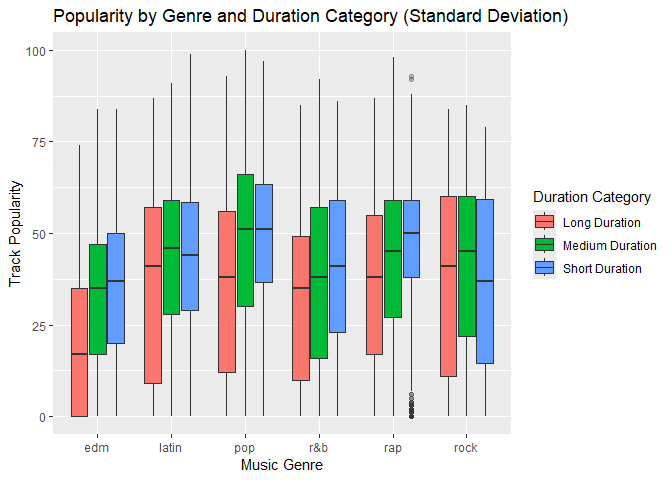
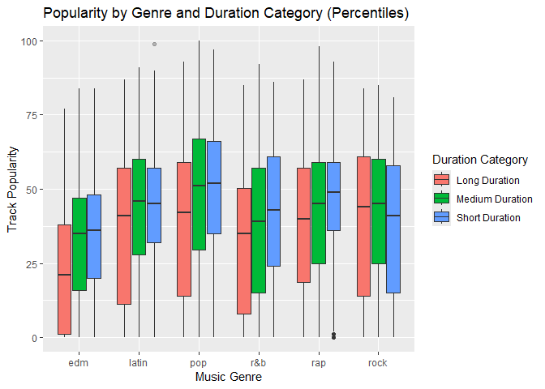

Duration
================
2024-11-24

``` r
spotify_df <- readr::read_csv('https://raw.githubusercontent.com/rfordatascience/tidytuesday/master/data/2020/2020-01-21/spotify_songs.csv')
```

    ## Rows: 32833 Columns: 23
    ## ── Column specification ─────────────────────────────────────────────────────────────────────────────
    ## Delimiter: ","
    ## chr (10): track_id, track_name, track_artist, track_album_id, track_album_na...
    ## dbl (13): track_popularity, danceability, energy, key, loudness, mode, speec...
    ## 
    ## ℹ Use `spec()` to retrieve the full column specification for this data.
    ## ℹ Specify the column types or set `show_col_types = FALSE` to quiet this message.

``` r
#data cleaning
spotify_df <- 
  spotify_df %>% 
  distinct(track_id, .keep_all = TRUE) %>% 
  select(-track_id, -track_album_id, -playlist_id) %>% 
  mutate(
    track_album_release_year = as.numeric(str_sub(track_album_release_date, 1, 4)), 
    playlist_name = factor(playlist_name),
    playlist_genre = factor(playlist_genre),
    playlist_subgenre = factor(playlist_subgenre)
  ) %>% 
  select(-track_album_release_date) 
```

``` r
#median approach
spotify_df_median <- 
  spotify_df %>%
  mutate(duration_median = case_when(  
      duration_ms >= median(duration_ms, na.rm = TRUE) ~ "Long Duration",
      duration_ms < median(duration_ms, na.rm = TRUE) ~ "Short Duration"
      )
    )
```

``` r
#standard deviation approach
spotify_df_sd <- spotify_df %>%
  mutate(
    duration_sd = case_when(
      duration_ms < mean(duration_ms, na.rm = TRUE) - sd(duration_ms, na.rm = TRUE) ~ "Short Duration",
      duration_ms > mean(duration_ms, na.rm = TRUE) + sd(duration_ms, na.rm = TRUE) ~ "Long Duration",
      TRUE ~ "Medium Duration"
    )
  )
```

``` r
#k-means approach
kmeans_result <- kmeans(spotify_df$duration_ms, centers = 3)

spotify_df_kmeans <- spotify_df %>%
  mutate(
    duration_kmeans = case_when(
      kmeans_result$cluster == 1 ~ "Short Duration",
      kmeans_result$cluster == 2 ~ "Medium Duration",
      kmeans_result$cluster == 3 ~ "Long Duration"
    )
  )
```

``` r
#percentile approach
spotify_df_perc <- spotify_df %>%
  mutate(
    duration_perc = case_when(
      duration_ms < quantile(duration_ms, 0.25, na.rm = TRUE) ~ "Short Duration",
      duration_ms > quantile(duration_ms, 0.75, na.rm = TRUE) ~ "Long Duration",
      TRUE ~ "Medium Duration"
    )
  )
```

``` r
#median approach plot
spotify_df_median %>%
  ggplot(aes(x = playlist_genre, y = track_popularity, fill = duration_median)) +
  geom_boxplot(outlier.alpha = 0.3) +
  labs(
    title = "Popularity by Genre and Duration Category (Median)",
    x = "Music Genre",
    y = "Track Popularity",
    fill = "Duration Category"
  ) 
```

<!-- --> We see that
for some Genre songs with long duration tend to have lower popularity,
for instance, edm and r&b. However, for others there is no such
significant differences.

``` r
#median approach anova test with effect size (Eta-squared)
anova_results_median <- spotify_df_median %>%
  group_by(playlist_genre) %>%
  summarise(
    anova = list(aov(track_popularity ~ duration_median, data = cur_data())),
    eta_squared = map_dbl(anova, ~ eta_squared(.)$Eta2[1])  
  )
```

    ## For one-way between subjects designs, partial eta squared is equivalent
    ##   to eta squared. Returning eta squared.
    ## For one-way between subjects designs, partial eta squared is equivalent
    ##   to eta squared. Returning eta squared.
    ## For one-way between subjects designs, partial eta squared is equivalent
    ##   to eta squared. Returning eta squared.
    ## For one-way between subjects designs, partial eta squared is equivalent
    ##   to eta squared. Returning eta squared.
    ## For one-way between subjects designs, partial eta squared is equivalent
    ##   to eta squared. Returning eta squared.
    ## For one-way between subjects designs, partial eta squared is equivalent
    ##   to eta squared. Returning eta squared.

``` r
anova_summary_median <- anova_results_median %>%
  mutate(
    f_statistic = map_dbl(anova, ~ summary(.)[[1]]$`F value`[1]),
    p_value = map_dbl(anova, ~ summary(.)[[1]]$`Pr(>F)`[1])
  )

anova_summary_median
```

    ## # A tibble: 6 × 5
    ##   playlist_genre anova  eta_squared f_statistic  p_value
    ##   <fct>          <list>       <dbl>       <dbl>    <dbl>
    ## 1 edm            <aov>     0.0380       193.    5.66e-43
    ## 2 latin          <aov>     0.00353       14.6   1.32e- 4
    ## 3 pop            <aov>     0.0129        67.0   3.36e-16
    ## 4 r&b            <aov>     0.0220       101.    1.53e-23
    ## 5 rap            <aov>     0.0179        98.7   4.67e-23
    ## 6 rock           <aov>     0.000133       0.572 4.49e- 1

By running anova test and compute effect size using Eta-squared we see
that while p-value is significant for all genre except rock with 0.45,
the effect size are all small. Hence we can say that Long-duration songs
are slightly less popular in some genres (e.g., EDM, R&B, Rap), but the
effect is small and not meaningful for practical applications.

``` r
#standard deviation approach plot
spotify_df_sd %>%
  ggplot(aes(x = playlist_genre, y = track_popularity, fill = duration_sd)) +
  geom_boxplot(outlier.alpha = 0.3) +
  labs(
    title = "Popularity by Genre and Duration Category (Standard Deviation)",
    x = "Music Genre",
    y = "Track Popularity",
    fill = "Duration Category"
  ) 
```

<!-- --> We see that
for some Genre songs with long duration tend to have lower popularity,
for instance, edm， pop, rap, and r&b. However, for latin and rock there
is no such significant differences.

``` r
#standard deviation approach anova test
anova_results_sd <- spotify_df_sd %>%
  group_by(playlist_genre) %>%
  summarise(
    anova = list(aov(track_popularity ~ duration_sd, data = cur_data())),
    eta_squared = map_dbl(anova, ~ eta_squared(.)$Eta2[1]))
```

    ## For one-way between subjects designs, partial eta squared is equivalent
    ##   to eta squared. Returning eta squared.
    ## For one-way between subjects designs, partial eta squared is equivalent
    ##   to eta squared. Returning eta squared.
    ## For one-way between subjects designs, partial eta squared is equivalent
    ##   to eta squared. Returning eta squared.
    ## For one-way between subjects designs, partial eta squared is equivalent
    ##   to eta squared. Returning eta squared.
    ## For one-way between subjects designs, partial eta squared is equivalent
    ##   to eta squared. Returning eta squared.
    ## For one-way between subjects designs, partial eta squared is equivalent
    ##   to eta squared. Returning eta squared.

``` r
anova_summary_sd <- anova_results_sd %>%
  mutate(
    f_statistic = map_dbl(anova, ~ summary(.)[[1]]$`F value`[1]),
    p_value = map_dbl(anova, ~ summary(.)[[1]]$`Pr(>F)`[1])
  )
anova_summary_sd
```

    ## # A tibble: 6 × 5
    ##   playlist_genre anova  eta_squared f_statistic  p_value
    ##   <fct>          <list>       <dbl>       <dbl>    <dbl>
    ## 1 edm            <aov>      0.0585       151.   1.56e-64
    ## 2 latin          <aov>      0.00397        8.24 2.67e- 4
    ## 3 pop            <aov>      0.0141        36.8  1.37e-16
    ## 4 r&b            <aov>      0.00870       19.7  2.91e- 9
    ## 5 rap            <aov>      0.0159        43.7  1.49e-19
    ## 6 rock           <aov>      0.00407        8.78 1.56e- 4

While all the genre music are statistically significant differences, the
effect sizes are very small or even negligible (with Eta-squared \<
0.02), indicating that duration explain only a small proportion of the
variance in popularity.

``` r
#k-means approach plot
spotify_df_kmeans %>%
  ggplot(aes(x = playlist_genre, y = track_popularity, fill = duration_kmeans)) +
  geom_boxplot(outlier.alpha = 0.3) +
  labs(
    title = "Popularity by Genre and Duration Category (K-Means)",
    x = "Music Genre",
    y = "Track Popularity",
    fill = "Duration Category"
  ) 
```

<!-- --> We see
that for some Genre songs with long duration tend to have lower
popularity, for instance, edm, latin, pop, and r&b. However, for rap and
rock there is no such significant differences.

``` r
#k-means approach anova test
anova_results_kmeans <- spotify_df_kmeans %>%
  group_by(playlist_genre) %>%
  summarise(
    anova = list(aov(track_popularity ~ duration_kmeans, data = cur_data())),
    eta_squared = map_dbl(anova, ~ eta_squared(.)$Eta2[1]))
```

    ## For one-way between subjects designs, partial eta squared is equivalent
    ##   to eta squared. Returning eta squared.
    ## For one-way between subjects designs, partial eta squared is equivalent
    ##   to eta squared. Returning eta squared.
    ## For one-way between subjects designs, partial eta squared is equivalent
    ##   to eta squared. Returning eta squared.
    ## For one-way between subjects designs, partial eta squared is equivalent
    ##   to eta squared. Returning eta squared.
    ## For one-way between subjects designs, partial eta squared is equivalent
    ##   to eta squared. Returning eta squared.
    ## For one-way between subjects designs, partial eta squared is equivalent
    ##   to eta squared. Returning eta squared.

``` r
anova_summary_kmeans <- anova_results_kmeans %>%
  mutate(
    f_statistic = map_dbl(anova, ~ summary(.)[[1]]$`F value`[1]),
    p_value = map_dbl(anova, ~ summary(.)[[1]]$`Pr(>F)`[1])
  )
anova_summary_kmeans
```

    ## # A tibble: 6 × 5
    ##   playlist_genre anova  eta_squared f_statistic  p_value
    ##   <fct>          <list>       <dbl>       <dbl>    <dbl>
    ## 1 edm            <aov>      0.0583       151.   2.68e-64
    ## 2 latin          <aov>      0.00561       11.7  8.99e- 6
    ## 3 pop            <aov>      0.0197        51.5  7.48e-23
    ## 4 r&b            <aov>      0.0225        51.9  5.11e-23
    ## 5 rap            <aov>      0.0190        52.4  2.91e-23
    ## 6 rock           <aov>      0.00440        9.51 7.59e- 5

Confirm to previous approaches, even with statistically significance
difference the duration have small practical impact on song popularity
across genres.

``` r
#percentile approach plot
spotify_df_perc %>%
  ggplot(aes(x = playlist_genre, y = track_popularity, fill = duration_perc)) +
  geom_boxplot(outlier.alpha = 0.3) +
  labs(
    title = "Popularity by Genre and Duration Category (Percentiles)",
    x = "Music Genre",
    y = "Track Popularity",
    fill = "Duration Category"
  ) 
```

<!-- --> We see
that for some Genre songs with long duration tend to have lower
popularity, for instance, edm, latin, pop, and r&b. However, for rap and
rock there is no such significant differences.

``` r
#percentile approach anova test
anova_results_perc <- spotify_df_perc %>%
  group_by(playlist_genre) %>%
   summarise(
    anova = list(aov(track_popularity ~ duration_perc, data = cur_data())),
    eta_squared = map_dbl(anova, ~ eta_squared(.)$Eta2[1]))
```

    ## For one-way between subjects designs, partial eta squared is equivalent
    ##   to eta squared. Returning eta squared.
    ## For one-way between subjects designs, partial eta squared is equivalent
    ##   to eta squared. Returning eta squared.
    ## For one-way between subjects designs, partial eta squared is equivalent
    ##   to eta squared. Returning eta squared.
    ## For one-way between subjects designs, partial eta squared is equivalent
    ##   to eta squared. Returning eta squared.
    ## For one-way between subjects designs, partial eta squared is equivalent
    ##   to eta squared. Returning eta squared.
    ## For one-way between subjects designs, partial eta squared is equivalent
    ##   to eta squared. Returning eta squared.

``` r
anova_summary_perc <- anova_results_perc %>%
  mutate(
    f_statistic = map_dbl(anova, ~ summary(.)[[1]]$`F value`[1]),
    p_value = map_dbl(anova, ~ summary(.)[[1]]$`Pr(>F)`[1])
  )
anova_summary_perc
```

    ## # A tibble: 6 × 5
    ##   playlist_genre anova  eta_squared f_statistic  p_value
    ##   <fct>          <list>       <dbl>       <dbl>    <dbl>
    ## 1 edm            <aov>      0.0545       141.   4.52e-60
    ## 2 latin          <aov>      0.00679       14.1  7.68e- 7
    ## 3 pop            <aov>      0.0209        54.8  2.90e-24
    ## 4 r&b            <aov>      0.0195        44.7  5.99e-20
    ## 5 rap            <aov>      0.0181        49.6  4.40e-22
    ## 6 rock           <aov>      0.00277        5.97 2.58e- 3

Again, while the popularity across duration categories are statistically
significant difference, duration explain a small proportion of the
variance in popularity.

### Overall

Long duration songs are slightly less likely to be more popular, but the
effect of duration is small and varies significantly across genres.
