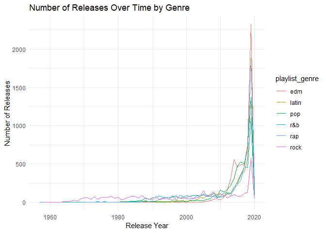

popularity trend
================
Senna
2024-11-23

``` r
library(tidyverse)
```

``` r
spotify_df = readr::read_csv('https://raw.githubusercontent.com/rfordatascience/tidytuesday/master/data/2020/2020-01-21/spotify_songs.csv') |>
  mutate(release_year = as.numeric(format(as.Date(track_album_release_date), "%Y")))
```

    ## Rows: 32833 Columns: 23
    ## ── Column specification ─────────────────────────────────────────────────────────────────────────────
    ## Delimiter: ","
    ## chr (10): track_id, track_name, track_artist, track_album_id, track_album_na...
    ## dbl (13): track_popularity, danceability, energy, key, loudness, mode, speec...
    ## 
    ## ℹ Use `spec()` to retrieve the full column specification for this data.
    ## ℹ Specify the column types or set `show_col_types = FALSE` to quiet this message.

``` r
genre_year = spotify_df|>
  group_by(playlist_genre, release_year)|>
  summarize(release_count = n(),
            avg_pop = mean(track_popularity, na.rm=TRUE))
```

    ## `summarise()` has grouped output by 'playlist_genre'. You can override using
    ## the `.groups` argument.

``` r
ggplot(genre_year, aes(x = release_year, y = release_count, color = playlist_genre)) +
  geom_line() +
  labs(title = "Number of Releases Over Time by Genre",
       x = "Release Year",
       y = "Number of Releases") +
  theme_minimal()
```

    ## Warning: Removed 6 rows containing missing values or values outside the scale
    ## range (`geom_line()`).

<!-- -->

``` r
ggplot(genre_year, aes(x = release_year, y = avg_pop, color = playlist_genre)) +
  geom_smooth()+
  labs(title = "Average Popularity Over Time by Genre",
       x = "Release Year",
       y = "Average Popularity") +
  theme_minimal()
```

    ## `geom_smooth()` using method = 'loess' and formula = 'y ~ x'

    ## Warning: Removed 6 rows containing non-finite outside the scale range
    ## (`stat_smooth()`).

<!-- -->

Since most songs in the data are released between 2010 and 2020:

``` r
spotify_10_20 <- spotify_df |>
  filter(release_year >= 2010 & release_year <= 2020)

spotify_10_20  |>
  group_by(playlist_genre, release_year) |>
  summarise(avg_pop = mean(track_popularity, na.rm = TRUE)) |>
  ungroup()|>
  ggplot(aes(x = release_year, y = avg_pop, color = playlist_genre))+
  geom_line()+
  geom_smooth()+
  labs(title = "Average Popularity Over Time by Genre (2010–2020)",
       x = "Release Year",
       y = "Average Popularity") +
  theme_minimal()
```

    ## `summarise()` has grouped output by 'playlist_genre'. You can override using the `.groups` argument.
    ## `geom_smooth()` using method = 'loess' and formula = 'y ~ x'

<!-- -->
